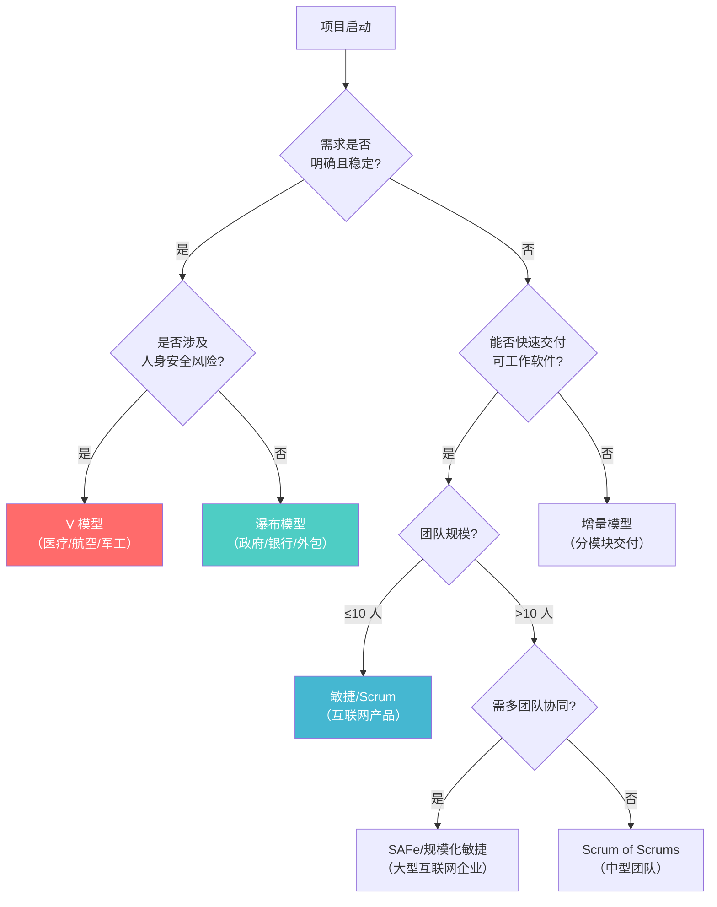
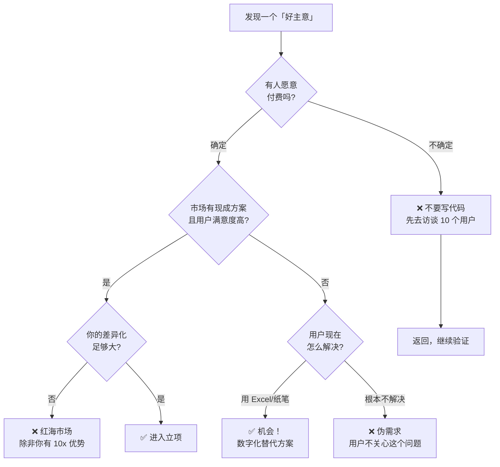
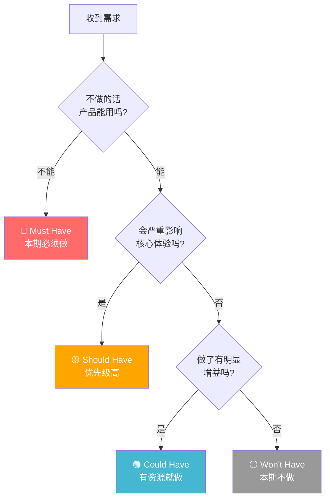
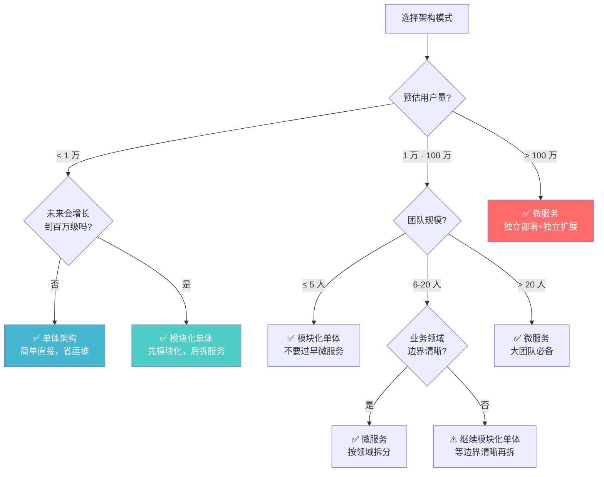
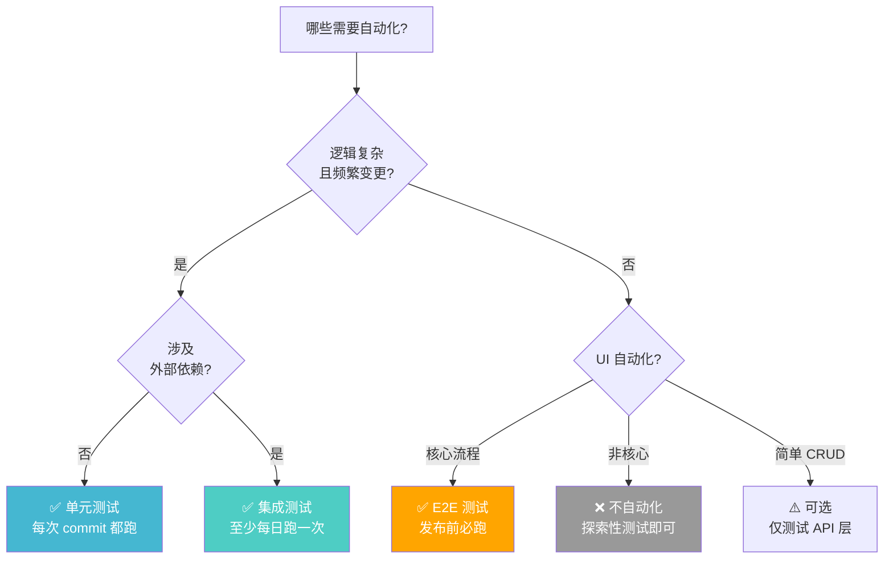
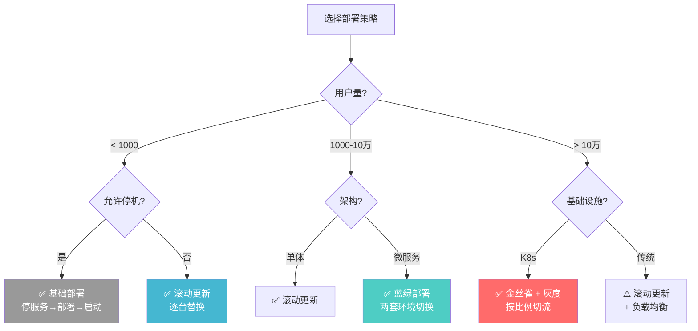
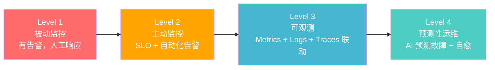
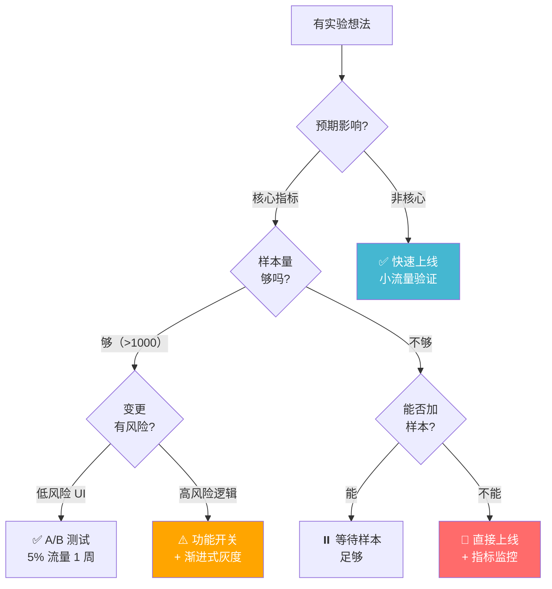
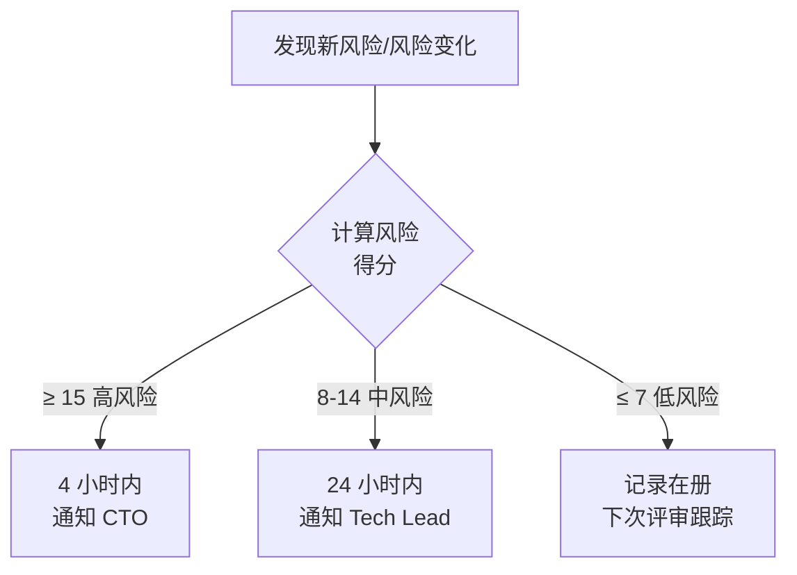

# 🏗️ 软件开发全流程标准操作手册 (SDLC SOP)

> **文档编号**: SOP-SD-001 V1.0 &nbsp;|&nbsp; **状态**: 草案 &nbsp;|&nbsp; **更新**: 2026-08-09
>
> 适用场景：个人快速查阅 · 新成员 onboarding · 项目启动 checklist · 面试准备

---

## 🗺️ 全流程鸟瞰


### 📐 SDLC 模型选择决策树

不同的项目适合不同的开发模型。选择错误的模型是项目失控的最常见原因之一。



> [!TIP] 💡 中国互联网企业实践
> 阿里/腾讯/字节等一线互联网公司普遍采用**敏捷+DevOps**混合模型。两周一个 sprint，每日站会，CI/CD 全自动化。但涉及金融支付、政府合规的项目，仍然采用**瀑布+V 模型**的变体。

| 模型 | 适用场景 | 典型企业/项目 | 核心优势 | 核心风险 |
|------|----------|--------------|----------|----------|
| 瀑布 | 需求稳定、周期长 | 银行核心系统、政府信息化 | 流程清晰、文档完整 | 后期变更成本极高 |
| V 模型 | 安全关键系统 | 医疗器械、航空航天 | 测试与开发并行 | 灵活性差 |
| 敏捷/Scrum | 需求多变、快速迭代 | 字节跳动 App、腾讯微信 | 快速反馈、拥抱变化 | 文档缺失、可维护性差 |
| DevOps | 互联网服务 | 阿里云产品、美团外卖 | 持续交付、快速回滚 | 基础设施要求高 |
| SAFe | 大型组织多团队 | 华为云、京东零售 | 规模化敏捷 | 流程繁重 |

---

## 🔍 阶段 0：市场与战略分析 — 「这事值不值做」

> **一句话目标**：别写代码，先验证。

### 必须回答的 5 个问题

| # | 问题 | 怎么做 |
|---|------|--------|
| 1 | **谁是你的用户？** | 用户画像（年龄/职业/痛点） |
| 2 | **市场已有方案？** | 竞品分析 + 你的差异化 |
| 3 | **怎么赚钱？** | 订阅 / 买断 / 广告 / 抽佣 / 免费增值 |
| 4 | **经济模型健康？** | CAC（获客成本）< LTV（用户生命周期价值）/3 |
| 5 | **合法吗？** | 金融/医疗/教育等需特殊资质 |

### ✅ 关键动作

- [ ] 至少跟 **10 个目标用户** 深度访谈（❌"你会不会用" → ✅"你现在怎么解决？"）
- [ ] 输出《竞品分析报告》TPL-MKT-001
- [ ] 输出《市场需求文档 MRD》TPL-MRD-001
- [ ] 建立《风险登记册》（≥ 5 条风险）
- [ ] 管理层签署《立项决议书》

> [!WARNING] 别跳过的坑
> 不做用户验证就写代码 = 赌博。数据隐私合规（GDPR/个保法）上线后补比一开始做贵 **10 倍**。

### 📊 市场分析方法详解

#### TAM / SAM / SOM 模型

这是评估市场机会的标准框架，也是**面试高频考点**。

| 层级 | 英文 | 含义 | 计算方法 | 示例（在线教育 SaaS） |
|------|------|------|----------|----------------------|
| **TAM** | Total Addressable Market | 你产品的理论天花板 | 目标用户总数 × 客单价 | 中国 2 亿学生 × ¥500/年 = ¥1000 亿 |
| **SAM** | Serviceable Available Market | 你的产品形态能覆盖的 | TAM 中你能触达的部分 | K12 在线题库市场：¥200 亿 |
| **SOM** | Serviceable Obtainable Market | 实际能拿到的份额 | SAM × 你的市场份额预期 | 首年目标 0.5% = ¥1 亿 |

> 🎯 **面试考点**：TAM/SAM/SOM 的区别是什么？为什么要做这个分析？答：TAM 证明"这事天花板够高"，SAM 证明"你的路径可行"，SOM 证明"近期目标可执行"。投资人先看 TAM 是否够大（通常要求 >¥100 亿），再看 SAM 是否合理。

#### 波特五力模型（Porter's Five Forces）

```mermaid
graph TD
    CENTER["🏢 竞争强度<br/>行业内的竞争对手"] --> |
    UP["⬆️ 供应商议价能力"]
    DOWN["⬇️ 购买者议价能力"]
    LEFT["⬅️ 新进入者威胁"]
    RIGHT["➡️ 替代品威胁"]

    CENTER -.-> UP
    CENTER -.-> DOWN
    CENTER -.-> LEFT
    CENTER -.-> RIGHT
```

| 力量 | 分析要点 | 示例（外卖平台） |
|------|----------|-----------------|
| 供应商议价能力 | 供应商集中度、切换成本 | 餐厅可选平台多，议价能力低 |
| 购买者议价能力 | 用户切换成本、价格敏感度 | 用户多平台比价，敏感度高 |
| 新进入者威胁 | 资本壁垒、网络效应 | 抖音外卖入局 → 高频冲击 |
| 替代品威胁 | 跨界替代的可能性 | 预制菜/社区食堂替代外卖 |
| 竞争强度 | 市场集中度、差异化 | 美团 vs 饿了么双寡头 |

### 🌲 阶段 0 核心决策树



### 🏢 中国一线企业实践参考

| 企业 | 立项方法 | 关键特点 |
|------|----------|----------|
| **字节跳动** | "产品圣经" + 数据验证 | 新项目必须先过「PM 内部赛马」，用 A/B 测试数据说话 |
| **阿里巴巴** | 战略五看（看宏观/行业/客户/竞争/自己） | 立项前必须有 MRD + 商业计划书，经过集团战略评审 |
| **腾讯** | "小步快跑、快速迭代" | 允许灰度失败，但要求 3 个月内必须有核心指标验证 |
| **美团** | "苦练基本功" | 重视线下调研——PM 必须实地走访商家，不能只靠二手数据 |

### ⚠️ 阶段 0 常见问题

<details>
<summary><b>Q1: 用户访谈总说"挺好的"，上线后没人用怎么办？</b></summary>

**问题根源**：人们倾向于礼貌性反馈。解决方案：
- ❌ 不要问"你会用吗"（诱导性问题）
- ❌ 不要问"你觉得怎么样"（太宽泛）
- ✅ 问"你现在怎么解决这个问题的？"
- ✅ 问"上次遇到这个问题是什么时候？怎么处理的？"
- ✅ 做一个 landing page + 付费按钮，看多少人点
- ✅ 收定金（真金白银比嘴上说诚实 100 倍）

**字节的方法**：不访谈，直接上线最小可用产品跑 A/B 测试，用数据代替意见。
</details>

<details>
<summary><b>Q2: 竞品分析要做到什么程度？</b></summary>

至少覆盖 3 个维度：
1. **功能对比矩阵**：你的核心功能 vs 竞品，标记差异化
2. **用户评价分析**：App Store 评论、知乎、NPS 数据
3. **技术栈分析**：竞品的技术架构（通过招聘 JD、技术博客反推）

底线：不能只看竞品官网——那上面只写优点。
</details>

<details>
<summary><b>Q3: 怎么判断一个市场"够不够大"？</b></summary>

- To C 产品：TAM > ¥50 亿（太小的话天花板太低）
- To B 产品：目标客户数 > 1000 家，客单价 > ¥5 万/年
- 但也要注意：**大赛道 ≠ 好赛道**。在线教育 2021 年前是万亿市场，政策一转向直接归零。
</details>

> 🎯 **面试考点**：
> - 需求验证的常见方法有哪些？（用户访谈/问卷调查/A/B测试/竞品分析/MVP验证）
> - 什么是 MVP？和完整产品的区别是什么？
> - STP 理论（Segmentation/Targeting/Positioning）的含义和应用

---

## 📋 阶段 1：需求工程 — 「到底做什么，不做什么」

### 核心输出

| 输出物 | 说明 |
|--------|------|
| **PRD** | 用户故事 + 功能规格 + 验收标准 + **明确不做的东西** |
| **RTM** | 需求追溯矩阵：每条需求 → 对应测试用例 |
| **原型** | 线框图/低保真原型即可 |

### ✅ 关键动作

- [ ] PRD 评审会：≥3 人签字（PM + Tech Lead + QA Lead）
- [ ] 验收标准必须**可测试**——不能写「体验好」
- [ ] 明确 MVP 边界——**什么不做**比做什么更重要

> [!TIP] 验收标准示例
> ✅ 好的：「用户输入邮箱+密码点击登录，3 秒内跳转到首页」
> ❌ 坏的：「登录体验流畅」

### 📄 PRD 模板框架（简化版）

一份合格的 PRD 至少应包含以下章节：

```
# [产品名称] 产品需求文档 Vx.x

## 1. 版本历史
| 版本 | 日期 | 作者 | 变更说明 |
|------|------|------|----------|

## 2. 项目背景与目标
- 为什么要做？（一句话说清楚）
- 不做会怎样？（紧迫性）
- 成功的衡量标准（OKR / KPI）

## 3. 用户分析
- 用户画像（谁用、什么场景、什么痛点）
- 用户旅程地图（当前 vs 目标）

## 4. 功能需求（MoSCoW 优先级）
- Must have（必须有，否则产品不可用）
- Should have（应该有，重要但非致命）
- Could have（可以有，锦上添花）
- Won't have（本期明确不做）

## 5. 非功能需求（NFR）
- 性能：核心 API P99 < 200ms
- 安全：https + 敏感数据加密 + 权限模型
- 可用性：99.9% (3 个 9)
- 兼容性：iOS 14+ / Android 8+

## 6. 用户故事与验收标准
| ID | 用户故事 | 验收标准 | 优先级 |
|----|----------|----------|--------|
| US-001 | 作为用户，我想用邮箱注册 | 输入邮箱+密码→验证码→成功跳转首页 | P0 |

## 7. 原型/线框图链接
- Figma: [链接]

## 8. 依赖与假设
- 依赖：XX 团队提供 OAuth 接口
- 假设：用户有手机号，合作方 API 稳定

## 9. 风险与应对
| 风险 | 概率 | 影响 | 应对 |
|------|------|------|------|
```

### 🎯 需求优先级决策：MoSCoW 方法



> 🎯 **面试考点**：MoSCoW 优先级的含义，和 Kano 模型的区别。Kano 模型将需求分为基本型/期望型/兴奋型/无差异型/反向型，用于**需求分类**；MoSCoW 用于**排期决策**。

### ⚠️ 需求变更管理流程

需求变更不可怕，可怕的是**没有流程的变更**。

```
变更申请 → 影响评估（工期/成本/风险） → CCB 评审（变更控制委员会）
                                              ↓
                              通过 → 更新 PRD + RTM + 通知全员
                              驳回 → 记录原因，归档
```

| 变更类型 | 审批人 | 时限 |
|----------|--------|------|
| 小改动（≤2 人天） | Tech Lead + PM | 1 个工作日 |
| 中等改动（2-10 人天） | CCB（≥3 人） | 3 个工作日 |
| 重大改动（>10 人天） | CCB + 管理层 | 5 个工作日 + 重新排期 |

### 📊 阶段 1 风险评估

| 风险 | 典型表现 | 概率 | 影响 | 缓解措施 |
|------|----------|------|------|----------|
| 需求蔓延（Scope Creep） | "顺便加一个小功能" | 高 | 高 | PRD 冻结 + CCB 评审 |
| 需求理解偏差 | PM 想的和 Dev 做的不一样 | 中 | 高 | 用户故事 + 验收标准 + 原型确认 |
| 遗漏非功能需求 | 上线后才发现性能不足 | 中 | 高 | PRD 必须包含 NFR 章节 |
| 干系人冲突 | 不同部门提矛盾需求 | 中 | 中 | PM 负责仲裁，记录冲突和决策理由 |
| 镀金（Gold Plating） | 开发加「自认为有用」的功能 | 中 | 中 | 严格按 PRD 开发，额外功能走变更流程 |

### 🌲 功能 vs 非功能需求区分（面试高频）

| 维度 | 功能需求 | 非功能需求 |
|------|----------|------------|
| 定义 | 系统"做什么" | 系统"做得怎么样" |
| 可测试性 | 验收标准可操作 | 需要量化指标 |
| 示例 | 用户登录、下单、搜索 | 响应时间 <200ms、并发 1000、99.9% 可用 |
| 遗漏后果 | 功能缺失 | 能用但不爽，甚至不能用 |

### ⚠️ 阶段 1 常见问题

<details>
<summary><b>Q1: PM 和开发对需求理解不一致怎么办？</b></summary>

**根因**：PRD 写得太抽象。解决方案：
- 每个用户故事必须有**可测试的验收标准**
- 用原型 + 实例化需求（Specification by Example）：给定什么输入 → 期望什么输出
- PRD 评审时，开发当场复述需求，PM 确认
</details>

<details>
<summary><b>Q2: 老板/业务方天天提需求怎么拒绝？</b></summary>

不要直接说"不"。三步法：
1. **记录入库**：「好的我记下来，排到 backlog 里」
2. **对齐优先级**：「目前我们在做 A 和 B，你这个大概什么时候要？跟 A 比哪个重要？」
3. **展示代价**：「加这个需求需要 2 周，B 功能会晚 2 周上线，OK 吗？」

让提需求的人自己做取舍——他们通常就不加了。
</details>

<details>
<summary><b>Q3: 用户说想要 A，但实际需要 B，怎么发现真正的需求？</b></summary>

**经典案例**：用户说「我要一匹更快的马」→ 实际需求是「更快地从 A 地到 B 地」→ 解决方案是汽车。

方法：**5 Whys 追问法**
- 用户：「我想要一个导出 Excel 的功能」
- PM：「导出后你用来做什么？」
- 用户：「发邮件给老板看数据」
- PM：「如果直接在系统里生成报表链接发给老板呢？」
- 用户：「那更好了！」

👉 用户提的是**方案**（导出 Excel），真正的需求是**目标**（汇报数据）。
</details>

> 🎯 **面试考点**：
> - 需求获取的常见方法？（访谈/问卷/观察/原型/竞品分析/文档分析）
> - 功能需求 vs 非功能需求的区别和示例
> - 需求验证的方法有哪些？（评审/原型/测试用例编写/用户确认）
> - 需求变更管理的流程是什么？

---

## 🏛️ 阶段 2：架构与顶层设计 — 「骨架定好，后面不返工」

### 必须产出的 6 份文档
| 文档 | 负责 | 核心内容 |
|------|------|----------|
| 架构设计文档 (SAD) | 架构师 | 系统边界、服务通信方式、数据流 |
| 数据库设计 | DBA/后端 | ER 图、核心表 Schema、索引策略 |
| 安全架构设计 | 安全工程师 | 认证方案(JWT/Session/OAuth2)、权限模型(RBAC)、数据加密 |
| DevOps 设计 | DevOps | CI/CD 流水线、容器编排、监控方案 |
| API 契约 (OpenAPI) | 架构师 | 所有 endpoint + 请求/响应格式 |
| ADR (架构决策记录) | 架构师 | 关键技术选型的理由和备选方案 |

### 技术选型原则
```
团队最熟 > 社区活跃 > 性能最优
```
不要在这一步引入"时髦但没人会"的技术栈——几乎一定会延期。

### 关键动作
- [ ] 威胁建模（STRIDE 方法论，对照 OWASP ASVS）
- [ ] 攻击面分析
- [ ] 所有架构文档评审通过
- [ ] ADR 写入 `/docs/adr/` 目录

> [!CAUTION] SOP 红线
> 安全活动（威胁建模/ASVS/攻击面分析）**不可裁剪**，无论团队多小。

### 🏛️ 架构模式决策树



> [!CAUTION] 微服务的代价
> 微服务不是银弹。它在给你独立部署、独立扩展的同时，也给你带来了分布式事务、网络延迟、运维复杂度。阿里的经验是：**不到 20 人团队、不到 100 万用户，单体完全足够**。

### 📐 架构质量属性（面试高频）

| 质量属性 | 含义 | 实现手段 | 权衡 |
|----------|------|----------|------|
| **可用性** | 系统正常运行的时间比例 | 冗余、故障转移、健康检查 | ↑ 成本 |
| **性能** | 响应时间、吞吐量 | 缓存、异步、CDN、索引 | ↑ 复杂度 |
| **可扩展性** | 系统增长的适应能力 | 水平扩展、无状态、分库分表 | ↑ 运维难度 |
| **安全性** | 防止非授权访问/数据泄露 | 加密、认证、审计、WAF | ↓ 性能 |
| **可维护性** | 修改和修复的容易程度 | 模块化、文档、代码规范 | 前期投入时间 |
| **可测试性** | 验证系统正确性的容易程度 | 依赖注入、接口抽象、Mock | - |

> 🎯 **面试考点**：给你一个系统场景，分析它最需要满足哪些质量属性（以及各属性之间的冲突）。例如：银行系统的安全性 > 性能；短视频 App 的性能 > 安全性（但安全性不能为 0）。

### 📄 ADR 模板

架构决策记录（ADR）是让后来者理解"当时为什么这么选"的关键文档。

```markdown
# ADR-001: 选择 PostgreSQL 作为主数据库

## 状态
✅ 已采纳 / ❌ 已否决 / 🔄 已取代（被 ADR-XXX 替代）

## 背景
我们需要选一个主数据库，候选方案是 PostgreSQL、MySQL、MongoDB。

## 决策
选择 PostgreSQL。

## 理由
1. 团队对 PostgreSQL 最熟悉（3 人中有 2 人用过生产环境）
2. 需要 JSON 查询能力，PostgreSQL 的 JSONB 比 MySQL 成熟
3. 社区活跃，文档完善
4. 开源协议友好

## 备选方案
- MySQL：团队也很熟，但 JSON 支持不如 PG
- MongoDB：不需要文档模型，引入新的运维成本

## 后果
- 正面：开发效率高、查询能力强
- 负面：托管服务（RDS）费用比 MySQL 高 ~15%
- 风险：团队新人需要 1 周学习 PG 特有语法
```

### 🏢 国内企业架构实践

| 企业 | 架构特点 | 关键经验 |
|------|----------|----------|
| **阿里巴巴** | 中台战略 → 拆中台 | 过度的中台化导致响应慢，2020 年后拆分为业务中台 |
| **字节跳动** | 微服务 + Service Mesh | 所有服务通过统一网关，标准化通信和安全 |
| **美团** | 领域驱动设计 (DDD) | 按业务领域划分微服务边界，避免"微服务 = 拆得越细越好" |
| **腾讯微信** | 高可用分布式 | 消息收发 99.99% 可用，核心服务极致简化 |

### 🛡️ STRIDE 威胁建模速查

| 威胁类型 | 含义 | 被威胁的属性 | 示例 | 缓解措施 |
|----------|------|-------------|------|----------|
| **S**poofing | 假冒身份 | 认证 | 伪造 JWT 登录 | MFA、密钥轮换 |
| **T**ampering | 篡改数据 | 完整性 | 修改订单金额 | 签名校验、HTTPS |
| **R**epudiation | 抵赖 | 不可否认性 | 下单后否认 | 审计日志、数字签名 |
| **I**nformation Disclosure | 信息泄露 | 机密性 | API 返回多余字段 | 数据脱敏、权限控制 |
| **D**enial of Service | 拒绝服务 | 可用性 | DDoS 攻击 | 限流、WAF、CDN |
| **E**levation of Privilege | 权限提升 | 授权 | 普通用户调用管理接口 | RBAC、最小权限 |

> 🎯 **面试考点**：STRIDE 六个字母分别代表什么？如何在实际项目中应用？

### ⚠️ 阶段 2 常见问题

<details>
<summary><b>Q1: 技术选型时，领导指定的技术栈我不认同怎么办？</b></summary>

三步法：
1. **用数据说话**：做性能对比测试、写 PoC（概念验证）代码
2. **用风险说话**：列出选 A 的风险（人力/社区/许可证）vs 选 B
3. **写 ADR**：无论最终选什么，把决策记录存档

关键心态：技术选型没有绝对的对错，**团队能维护好的就是好选型**。
</details>

<details>
<summary><b>Q2: 什么时候应该从单体拆成微服务？</b></summary>

判断标准（满足 ≥ 2 条就该考虑）：
1. 不同模块的开发速度互相阻塞（A 团队等 B 团队发版）
2. 不同模块需要独立扩缩容（订单量暴增但用户模块稳定）
3. 不同模块需要不同的技术栈（搜索用 ES，实时用 Go，业务用 Java）
4. 团队规模 > 20 人，单体代码冲突频繁

**阿里的教训**：不要为了微服务而微服务。模块化单体 + 清晰的包依赖 > 混乱的微服务。
</details>

<details>
<summary><b>Q3: 怎么选择合适的数据库？</b></summary>

```
需要复杂事务（ACID）? → 关系型（PostgreSQL / MySQL）
需要海量写入+简单查询? → 时序（InfluxDB / TDengine）
需要灵活 Schema? → 文档型（MongoDB）
需要高性能缓存? → KV（Redis）
需要全文搜索? → 搜索引擎（Elasticsearch）
需要图关系查询? → 图数据库（Neo4j）
```

大多数项目：**PostgreSQL 一把梭够了**。别一上来就多数据库——运维成本是指数级增长的。
</details>

---

## 🎨 阶段 3：详细设计与 UI/UX — 「让用户看到的东西」

### 核心输出
- **高保真 UI 设计稿**：含所有状态——正常、空数据、加载中、出错、边界情况
- **交互原型**（Figma 可交互原型）
- **前后端详细设计**

### 关键动作
- [ ] UI 走查：前端 + 设计师 + PM 一起过一遍
- [ ] Figma 检查：所有组件命名规范、设计 Token 统一
- [ ] 后端接口与前端联调协议确认

> [!TIP] 设计师交付规范
> 设计稿应包含所有状态：**正常态 / 空态 / 加载态 / 错误态 / 极限数据**（超长文本）——而不是只给一个「完美」状态。

### 🎨 UI/UX 设计检查清单

这是 UI 走查时的必备检查项，确保**所有状态都被考虑**：

| 类别 | 检查项 | 是否覆盖 |
|------|--------|----------|
| **数据状态** | 空数据（Empty State）引导用户下一步 | [ ] |
| | 加载中（Loading）骨架屏 / spinner | [ ] |
| | 部分数据（Partial）分页/懒加载 | [ ] |
| | 满数据（Full）正常展示 | [ ] |
| | 超长数据（Overflow）截断+省略号/tooltip | [ ] |
| | 数据过期（Stale）刷新提示 | [ ] |
| **用户操作** | 正常操作路径（Happy Path） | [ ] |
| | 操作错误（Error）友好提示+恢复路径 | [ ] |
| | 操作确认（Confirm）删除/支付等危险操作 | [ ] |
| | 操作撤销（Undo）3-5 秒内可撤销 | [ ] |
| | 操作中断（Interrupt）网络断开/超时 | [ ] |
| **权限状态** | 未登录 | [ ] |
| | 无权限（401/403） | [ ] |
| | 功能灰度（未开放） | [ ] |
| **设备适配** | 小屏（320px） | [ ] |
| | 中屏（768px） | [ ] |
| | 大屏（1440px+） | [ ] |
| | 暗黑模式（Dark Mode） | [ ] |
| **无障碍** | 键盘可操作 | [ ] |
| | 屏幕阅读器友好（alt/aria-label） | [ ] |
| | 颜色对比度 ≥ 4.5:1 | [ ] |

### 🔗 接口设计规范（前后端联调基础）

```yaml
# OpenAPI 3.0 规范示例
/api/v1/users/{id}:
  get:
    summary: 获取用户信息
    parameters:
      - name: id
        in: path
        required: true
        schema:
          type: integer
    responses:
      '200':
        description: 成功
        content:
          application/json:
            schema:
              type: object
              properties:
                code: { type: integer, example: 0 }
                msg: { type: string, example: "success" }
                data:
                  type: object
                  properties:
                    id: { type: integer }
                    name: { type: string }
                    email: { type: string, format: email }
      '404':
        description: 用户不存在
        content:
          application/json:
            schema:
              type: object
              properties:
                code: { type: integer, example: 40401 }
                msg: { type: string, example: "用户不存在" }
```

**接口规范约定**：
1. **统一响应格式**：`{ code, msg, data }` — 所有接口保持一致
2. **错误码体系**：HTTP 状态码 + 业务错误码（如 40401 = 用户不存在）
3. **分页规范**：`?page=1&size=20`，返回 `{ items, total, page, size }`
4. **版本管理**：URL 路径版本（`/api/v1/`）或 Header 版本

### 📐 后端详细设计模板

```
# [模块名] 详细设计文档

## 1. 模块概述
- 职责：一句话描述
- 上下游依赖

## 2. 接口定义
- 接口路径、方法、参数、返回值、错误码
- （引用 OpenAPI 文档链接）

## 3. 数据模型
- 表结构、索引、字段说明
- 数据流转图

## 4. 核心流程
- 时序图 / 流程图
- 异常处理策略

## 5. 配置项
- 有哪些可配置参数
- 默认值和取值范围

## 6. 测试要点
- 正常场景
- 边界场景
- 异常场景
```

### ⚠️ 阶段 3 常见问题

<details>
<summary><b>Q1: 设计师只给了一个"完美状态"，开发时要补 80% 的 UI 状态怎么办？</b></summary>

这是最常见的痛点。解决方法：
- **在设计交付规范中明确**：交付物必须包含所有状态
- **建立组件库**：Loading/Empty/Error 做成标准组件，全项目统一
- 前端同学不要"忍"——看到缺少的状态立刻在走查时提出，越早补代价越小
</details>

<details>
<summary><b>Q2: 前端和后端对接口字段理解不一致怎么对齐？</b></summary>

- **契约优先（Contract First）**：先定义 OpenAPI 文档，前后端各自开发时都对着文档
- 用工具自动校验：前端请求/后端响应 vs OpenAPI 规范
- 接口联调时两端当场确认——不是"接口文档写了对的就行"
</details>

<details>
<summary><b>Q3: 设计评审总能发现大量问题，是不是设计做得不好？</b></summary>

正好相反——**评审发现的问题越多，说明评审越有效**。评审是最后的防线之一：在纸上改的成本是写代码时改的 1/10。如果在评审阶段没发现问题，到开发阶段才发现，代价是 10 倍。
</details>

> 🎯 **面试考点**：
> - UI/UX 设计中的"状态覆盖"是什么意思？为什么重要？
> - 什么是 Contract-First 开发？有什么优势？
> - 前后端分离的接口约定要注意什么？

---

## 💻 阶段 4：开发与编码 — 「开始写代码」

### 团队最小配置（MVP 阶段）
| 角色 | 人数 | 工作 |
|------|------|------|
| 产品经理 | 1 | 需求、优先级 |
| 设计师 | 1 | UI/UX（可兼职） |
| 后端工程师 | 1-2 | API、DB、核心逻辑 |
| 前端工程师 | 1-2 | 用户界面 |
| 或：全栈工程师 | 1-2 | 小团队最优 |

### 开发纪律

#### 代码规范（pre-commit hook 强制）
- Formatter: Prettier / Black / gofmt
- Linter: ESLint / Ruff / golangci-lint
- Type check: TypeScript strict / Python mypy strict
- **以上全部配 pre-commit，不通过不能 commit**

#### 分支策略
```
feature/<TICKET>-<desc>  →  PR  →  main
hotfix/<ver>-<desc>      →  PR  →  main（紧急通道）
```
- main 分支受保护：禁止直接 push
- PR ≥ 1 人 Approve 才能合并
- CI 必须全绿
- Squash and Merge，合并后删除源分支

#### 每日流程
1. 每日站会 ≤ 15 分钟（只说阻塞，不说细节）
2. 从 main 拉 feature 分支
3. **先/同步写测试**（核心路径必须覆盖）
4. 实现功能
5. 本地跑通完整链路
6. 提 PR（≤ 500 行改动，大的拆小）

### 质量门禁（不通过不能合代码）
- [ ] CI 全绿（lint + type-check + test）
- [ ] SonarQube 无 Blocker 级别问题
- [ ] 代码覆盖率 ≥ 80%
- [ ] PR 审查通过（至少 1 人）
- [ ] SBOM（软件物料清单）生成

### 代码审查检查清单（6 个必须项）
1. **逻辑**：与 PRD/设计一致？边界和异常处理完整？
2. **安全**：输入校验？敏感数据加密？权限每接口检查？
3. **性能**：DB 有索引/无 N+1？无 O(n²) 代码？缓存 TTL 合理？
4. **可读性**：命名规范？函数 ≤ 50 行单一职责？无魔法数字？
5. **测试**：新功能有自动化测试？覆盖正常/边界/异常？
6. **文档**：对外 API 有注释？业务变更同步 PRD/SAD/ADR？

> [!WARNING] 外包团队要求
> 禁止使用公共 AI 助手（ChatGPT 等）处理内部代码；企业私有 AI 需审批。

### 🌲 Git 工作流决策树

```mermaid
flowchart TD
    START["选择 Git 工作流"] --> Q1{"需要维护<br/>多个版本吗?"}
    Q1 -->|是| Q2{"版本周期?"}
    Q1 -->|否| Q3{"团队规模?"}
    Q2 -->|长周期(月)| GF["✅ Git Flow<br/>master/develop/feature/release/hotfix"]
    Q2 -->|短周期(周)| GF2["⚠️ GitHub Flow<br/>+ release 分支"]
    Q3 -->|≤ 5 人| TBD["✅ Trunk-Based<br/>直接在 main 上短分支"]
    Q3 -->|6-20 人| GH["✅ GitHub Flow<br/>feature → PR → main"]
    Q3 -->|> 20 人| GF3["GitHub Flow<br/>+ CODEOWNERS + 分支保护"]

    style GF fill:#ff6b6b,color:#fff
    style GH fill:#45b7d1,color:#fff
    style TBD fill:#4ecdc4,color:#fff
```

> [!TIP] 💡 选型建议
> 90% 的互联网项目用 **GitHub Flow**（feature 分支 → PR → main）就够了。Git Flow 适合需要同时维护多个生产版本的项目（如客户端 SDK、操作系统发行版）。

### 📏 代码规范最佳实践（业界参考）

| 语言 | Formatter | Linter | Type Check | 配置参考 |
|------|-----------|--------|------------|----------|
| TypeScript | Prettier | ESLint + oxlint | tsc --strict | Airbnb Style Guide |
| Python | Black / Ruff | Ruff | mypy --strict | Google Python Style Guide |
| Go | gofmt | golangci-lint | - (内置) | Uber Go Style Guide |
| Java | google-java-format | Checkstyle + SpotBugs | - (编译期) | Google Java Style Guide |
| Rust | rustfmt | Clippy | - (编译期) | Rust API Guidelines |

> 🏢 **国内实践**：大多数公司（阿里/字节/腾讯）都有基于以上开源规范的**内部定制版**，核心差异在于命名规范中的公司前缀（如 `AliXXX`）、日志格式、以及组件的使用约束。

### 🧩 常见反模式（代码审查时重点排查）

| 反模式 | 表现 | 为什么不好 | 如何修正 |
|--------|------|-----------|----------|
| God Class | 一个类 2000+ 行 | 不可维护、不可测试 | 按职责拆分 |
| 魔法数字 | `if status == 3` | 不可读 | 定义常量 `STATUS_EXPIRED = 3` |
| N+1 查询 | 循环里查 DB | 性能灾难 | 批量查询 / JOIN |
| 过度嵌套 | 5 层 if/for | 不可读 | 提前 return / 卫语句 |
| 重复代码 | 同一逻辑出现 3 次+ | 修改遗漏 | 提取公共函数 |
| 吞噬异常 | `try { ... } catch(e) {}` | 问题被隐藏 | 记录日志 + 业务处理 |
| 过早优化 | 为"未来可能需要"写得复杂 | 浪费 + 增加 bug | 需要时再优化 |

### 📊 阶段 4 风险评估

| 风险 | 概率 | 影响 | 缓解措施 |
|------|------|------|----------|
| 技术债快速增长 | 高 | 高 | 每次 sprint 留 20% 时间还债 |
| 代码质量下降 | 中 | 高 | CI 质量门禁 + PR 审查不走过场 |
| 进度延期 | 高 | 高 | 每日站会 15 分钟暴露阻塞 |
| 关键人员离职 | 低 | 极高 | 结对编程 + 文档 + 知识共享 |
| 技术方案不可行 | 低 | 高 | Spike（技术预研）在正式开发前 |

### ⚠️ 阶段 4 常见问题

<details>
<summary><b>Q1: 写测试感觉浪费时间，怎么说服自己（和团队）？</b></summary>

数据说话：
- 有单元测试的项目，bug 修复成本平均降低 **40%**
- 重构时信心提升 **10 倍**（你敢改不敢改的区别）
- 新人接手时，测试就是最好的文档

底线策略：**核心业务路径必须覆盖**。CRUD 可以少写，支付/登录/数据一致性相关的必须有。
</details>

<details>
<summary><b>Q2: PR 审查矛盾——我认真审查导致进度慢 vs 快速通过导致质量差？</b></summary>

折中方案：
- **小 PR（≤200 行）**：快速审查，重点看逻辑和安全
- **中 PR（200-500 行）**：全面审查，但控制在 30 分钟内
- **大 PR（>500 行）**：拆成多个 PR 再审——或者开一次"代码走查会"
- 紧急 hotfix：简化审查（至少 1 人 + 安全点）

核心原则：**不审查的代码一定会出问题——只是时间问题。**
</details>

<details>
<summary><b>Q3: 新人不熟悉代码规范，PR 总是被打回怎么办？</b></summary>

- 配好 pre-commit hook：Formatter + Linter 自动检查，不通过不能 commit——这解决 80% 问题
- 团队维护 `.editorconfig` + IDE 配置共享
- 第一次被打回时，审查者不只说"不行"，还要说"为什么"和"应该怎么写"
- 新人第一个 sprint 的 PR 必须由 mentor 预先过一遍再提正式 PR
</details>

> 🎯 **面试考点**：
> - Git Flow vs GitHub Flow vs Trunk-Based Development 的区别？
> - 代码审查的核心要点是什么？
> - 技术债怎么管理？
> - CI/CD 流水线包含哪些质量门禁？
> - 什么是 TDD（测试驱动开发）？和传统开发有什么区别？

---

## 🧪 阶段 5：测试与质量保证 — 「在用户踩之前自己先踩」

### 测试金字塔
```
        / E2E (2-3条核心路径) \
       /    集成测试 (API/DB)  \
      /    单元测试 (核心逻辑)   \
     ─────────────────────────────
```

### 测试执行分层
| 层次 | 谁做 | 内容 |
|------|------|------|
| 单元/集成 | 开发（CI 自动） | 代码级别 |
| 功能测试 | QA | 按用例逐条走 |
| 探索性测试 | QA / PM | 不按脚本，随意操作 |
| UAT 验收 | PM / 业务方 | 用户视角验收 |
| 灰度内测 | 内部 + 种子用户 | 真实环境小范围 |

### 准出条件（有一条不满足不能上线）
- [ ] 冒烟测试 100% 通过
- [ ] 测试通过率 ≥ 95%
- [ ] S1（严重）和 S2（高危）bug 数量 = 0
- [ ] 性能测试达标（核心 API 压测通过）
- [ ] 安全测试无高危漏洞
- [ ] UAT 签字确认

> [!TIP]
> 测试用例要在**开发期间**就写好，不是开发完才补。

### 🌲 自动化测试策略决策树



### 🔧 测试工具选型参考

| 层次 | 前端 | 后端 (JS/TS) | 后端 (Python) | 后端 (Java) | 后端 (Go) |
|------|------|-------------|---------------|------------|-----------|
| 单元测试 | Vitest / Jest | Jest / Vitest | pytest | JUnit 5 + Mockito | testing |
| 集成测试 | Playwright | Supertest | pytest + httpx | TestContainers | testify |
| E2E | Playwright / Cypress | Playwright | Playwright | Playwright / Selenium | - |
| API 测试 | - | Supertest | pytest + requests | REST Assured | httptest |
| 性能测试 | k6 (少量) | k6 / autocannon | Locust | JMeter / Gatling | vegeta |
| 安全测试 | OWASP ZAP | OWASP ZAP | OWASP ZAP | OWASP ZAP | OWASP ZAP |

### 🐛 Bug 严重等级定义

| 等级 | 名称 | 定义 | 示例 | 响应时限 |
|------|------|------|------|----------|
| **S1** | 阻塞 | 核心功能完全不可用，无绕过方案 | 支付失败、登录崩溃 | 2 小时内修复 |
| **S2** | 严重 | 主要功能受损，有绕过方案但体验极差 | 搜索结果延迟 10s | 24 小时内修复 |
| **S3** | 一般 | 非核心功能异常 | 头像上传失败 | 当前迭代内修复 |
| **S4** | 轻微 | UI 错位、文案错误 | 按钮间距不对 | 排期修复 |
| **S5** | 建议 | 改进建议，非 bug | "按钮可以更大" | backlog |

### 📊 阶段 5 风险评估

| 风险 | 概率 | 影响 | 缓解措施 |
|------|------|------|----------|
| 测试用例覆盖不足 | 高 | 高 | 需求追溯矩阵 (RTM) + 覆盖率工具 |
| 环境差异导致测试无效 | 中 | 高 | 测试环境与生产一致（IaC 保证） |
| 回归 bug（修 A 坏 B） | 高 | 中 | 自动化回归测试 + CI 自动触发 |
| 性能瓶颈未发现 | 中 | 高 | 上线前压测（≥ 预期峰值 2x） |
| 安全问题漏检 | 低 | 极高 | SAST + DAST + 渗透测试三层覆盖 |

### 🏢 国内企业测试实践

| 企业 | 测试策略 | 特色 |
|------|----------|------|
| **字节跳动** | 质量左移 + 自动化为主 | 开发自测 + QA 做探索性测试，自动化覆盖率 >70% |
| **阿里巴巴** | 全链路压测 | 双 11 前全链路压测，模拟峰值 10x 流量 |
| **美团** | 分层测试 + 故障演练 | 单元/集成/E2E 三层 + 混沌工程定期演练 |
| **腾讯** | 灰度 + 监控驱动 | 微信支付发布必须过灰度，监控指标异常自动回滚 |

### ⚠️ 阶段 5 常见问题

<details>
<summary><b>Q1: 测试环境和生产环境不一致导致"测试过但上线炸"？</b></summary>

根因：环境差异（数据库版本、配置、第三方 API 版本等）。
解决方案：
- **基础设施即代码 (IaC)**：用 Terraform / Pulumi 管理环境，保证一致性
- **容器化**：测试和生产用同一 Docker 镜像
- **契约测试**：用 Pact 验证上下游接口兼容性
- 数据库用**生产数据脱敏后的副本**做测试
</details>

<details>
<summary><b>Q2: 开发说"没时间写测试"，QA 压力全在后端怎么办？</b></summary>

这是文化问题，不是技术问题：
- **质量门禁不可绕过**：覆盖率不达标 CI 直接拒绝合并
- **测试计入工作量**：估算时明确包含测试时间（通常占总工时 30-50%）
- **用数据说服**：追踪一段时间，"有测试的模块 bug 率" vs "没测试的模块 bug 率"——数据是最好的说服工具
</details>

<details>
<summary><b>Q3: 探索性测试和随机点点点有什么区别？</b></summary>

探索性测试是**有策略的随机**：
- Session-Based Test Management (SBTM)：固定时间段（如 90 分钟）内，有针对性的探索
- 使用测试宪章（Charter）："探索支付模块在弱网环境下的异常处理"
- 记录发现的问题 + 覆盖的路径
- 不是"随便点点"，是"假设有 bug 在哪"的侦探式测试
</details>

> 🎯 **面试考点**：
> - 测试金字塔的各个层次和占比？
> - 黑盒测试 vs 白盒测试 vs 灰盒测试的区别？
> - 什么是回归测试？为什么重要？
> - 等价类划分和边界值分析的含义和示例？
> - 什么是持续集成（CI）？和测试的关系是什么？

---

## 📦 阶段 6：构建与打包 — 「把代码变成制品」

**目的**：把代码变成可部署的制品，标记版本。

### 关键动作
- [ ] 版本号标记（遵循 SemVer：MAJOR.MINOR.PATCH）
- [ ] CHANGELOG 更新
- [ ] Git Tag 打标签
- [ ] 制品推送到仓库（Nexus/JFrog/Docker Registry）

### 🔧 现代构建工具链

| 语言/平台 | 构建工具 | 包管理 | 制品类型 | CI 集成 |
|-----------|----------|--------|----------|---------|
| TypeScript/Node | esbuild / tsc / Vite | npm / pnpm / yarn | .js + .d.ts + sourcemap | GitHub Actions |
| Python | - (车轮包) | uv / poetry / pip | .whl / Docker image | GitLab CI |
| Go | go build | go mod | 静态二进制 | GitHub Actions |
| Java/Kotlin | Maven / Gradle | Maven Central | .jar / .war / Docker | Jenkins |
| Docker | docker buildx | - (Dockerfile) | OCI image | 任意 CI |
| Rust | cargo build | crates.io | 静态二进制 | GitHub Actions |

### 📐 SemVer 版本规范详解（面试高频）

```
MAJOR.MINOR.PATCH  →  主版本.次版本.修订版本

v2.7.3
 │  │  └── PATCH: 向后兼容的 bug 修复
 │  └──── MINOR: 向后兼容的新功能
 └─────── MAJOR: 不兼容的 API 变更
```

| 变更类型 | 版本变化 | 示例 |
|----------|----------|------|
| Bug 修复（向后兼容） | PATCH +1 | `v2.7.3` → `v2.7.4` |
| 新功能（向后兼容） | MINOR +1, PATCH=0 | `v2.7.3` → `v2.8.0` |
| 破坏性变更 | MAJOR +1, 其余=0 | `v2.7.3` → `v3.0.0` |
| 预发布版 | 加后缀 | `v3.0.0-alpha.1`, `v3.0.0-rc.2` |
| 构建元数据 | 加 `+` | `v3.0.0+build.20260809` |

### 🔐 构建安全（供应链安全）

> [!WARNING] 供应链攻击
> SolarWinds (2020)、xz utils (2024) 等事件表明：构建流水线是重要的攻击面。

| 安全措施 | 工具 | 目的 |
|----------|------|------|
| SBOM 生成 | Syft / CycloneDX | 记录所有依赖的物料清单 |
| 依赖漏洞扫描 | Trivy / Snyk / Dependabot | 已知漏洞检测 |
| 构建产物签名 | Cosign / Notary | 验证制品来源可信 |
| 镜像最小化 | distroless / Alpine | 减少攻击面 |
| 密封构建 | SLSA Level 3+ | 确保构建过程不可篡改 |

### ⚠️ 阶段 6 常见问题

<details>
<summary><b>Q1: 什么时候应该打 MAJOR 版本？</b></summary>

典型信号：
- 公开 API 签名变更（删除/重命名/参数变必填）
- 行为向后不兼容（返回值格式变了）
- 不支持的数据格式/协议版本
- 删除已弃用的功能

**不适合打 MAJOR**：
- 大的内部重构（对外 API 不变）
- 新增功能（即使很大）
- Bug 修复（即使影响很大）
</details>

<details>
<summary><b>Q2: 为什么构建要在 CI 环境跑而不是本地？</b></summary>

- **环境一致性**：本地可能有未提交的文件/环境变量
- **可审计**：每个版本的构建日志可追溯
- **安全**：CI 环境隔离，不受开发者本地工具链污染
- **密封构建**（Reproducible Builds）：同一次 commit，无论谁构建，产物一致
</details>

> 🎯 **面试考点**：
> - SemVer 三个数字分别代表什么？
> - 什么是 CI/CD？持续集成和持续交付/部署的区别？
> - 什么是 SBOM（软件物料清单）？为什么重要？
> - 构建一次、到处部署（Build Once, Deploy Anywhere）的含义？

---

## 🚀 阶段 7：部署与发布 — 「D-Day」

### 发布执行 Runbook（精确到分钟的检查清单）
```
22:00  发布公告（用户群/官网维护 banner）
22:05  数据库备份快照
22:10  执行 DB migration
22:15  验证 migration 成功
22:20  金丝雀发布（先 1 台）
22:25  后端冒烟测试通过
22:30  后端全量部署（rolling update）
22:35  前端部署
22:40  CDN 刷新
22:45  端到端烟雾测试（注册→核心功能→支付 全流程）
22:50  监控确认：错误率 0、延迟正常、业务指标正常
23:00  撤掉维护 banner，发布公告
23:00-01:00 全员值守观察
```

### 灰度发布节奏
```
内部员工 → 1% → 5% → 25% → 100%
```
每个阶段观察 15-30 分钟，任一指标异常 → 暂停，排查。

### 自动回滚触发条件（配在监控里，自动触发）

| 条件 | 阈值 |
|------|------|
| 错误率飙升 | 发布 5 分钟内 > 5% |
| P99 延迟退化 | 超基线 2 倍持续 3 分钟 |
| 核心业务指标下降 | 支付成功率等下降 > 10% |
| 服务不可用 | Pod CrashLoopBackOff / health 连续失败 |
| 数据库异常 | 连接池耗尽 / 死锁 / 慢查询 > 500% |

> [!CAUTION] 回滚原则
> **先回滚、后排查、最后写事故报告**。回滚应该是确定性操作而非「紧急操作」。

### 🌲 部署策略决策树



### 📊 四种部署策略对比

| 策略 | 原理 | 停机时间 | 资源成本 | 回滚速度 | 适用场景 |
|------|------|----------|----------|----------|----------|
| **基础部署** | 全部下线→更新→上线 | 有（分钟级） | 低 | 慢 | 内部工具、非关键系统 |
| **滚动更新** | 逐台替换 | 无 | 中 | 中 | Web 应用（多数场景） |
| **蓝绿部署** | 两套环境切换 | 无（秒级） | **高**（2x 资源） | **快**（秒级） | 关键系统、金融支付 |
| **金丝雀部署** | 少量→逐步全量 | 无 | 中 | **快**（切回旧版） | 用户量大的互联网产品 |

### 🔧 DB Migration 规范

数据库变更是部署中最危险的操作之一。

```sql
-- ✅ 好的 Migration：可回滚、向后兼容
-- UP（执行变更）
ALTER TABLE users ADD COLUMN phone VARCHAR(20);
ALTER TABLE users ADD INDEX idx_phone (phone);

-- DOWN（回滚变更）← 必须有！
DROP INDEX idx_phone ON users;
ALTER TABLE users DROP COLUMN phone;
```

| 原则 | 说明 |
|------|------|
| **每 Migration 有 DOWN** | 不能回滚的 Migration 不能上线 |
| **向后兼容** | 加字段不删字段，先加后删 |
| **大表变更** | 超 1000 万行用 pt-online-schema-change / gh-ost（不锁表） |
| **先改后删** | 需要删字段：先标记废弃 → 观察 → 确认无引用 → 再删 |
| **Migration 在代码前** | 先跑 Migration 再部署新代码，反之可能炸 |

### ⚠️ 阶段 7 常见问题

<details>
<summary><b>Q1: 蓝绿部署和滚动更新怎么选？</b></summary>

简化版判断：
- **能用蓝绿绝对用蓝绿**：回滚最快，最安全——但需要 2x 资源
- 预算不够 → 滚动更新
- 用户量极大（百万级）→ 金丝雀 + 灰度发布
- 金融/支付 → 蓝绿（秒级回滚是刚需）
</details>

<details>
<summary><b>Q2: DB migration 执行失败怎么办？能回滚吗？</b></summary>

三步预案：
1. **Migration 脚本必须有 DOWN 部分**——这是上线的前提条件
2. 如果 DOWN 也失败了（数据已部分变更）→ **从备份恢复**
3. 根本预防：大表变更不使用直接的 ALTER TABLE，使用 gh-ost 等在线变更工具

**血的教训**：不要在生产环境直接 `ALTER TABLE` 一个 1 亿行的表——会锁表几分钟甚至几小时。
</details>

<details>
<summary><b>Q3: 发布后发现 bug，是先 hotfix 还是先回滚？</b></summary>

**先回滚，再 hotfix。**
- 回滚：5 分钟内恢复服务，用户无感知
- Hotfix：可能需要 30 分钟定位 + 修复 + 重新部署

时间窗口：如果 bug 影响 < 1% 用户且不致命 → 可以 hotfix；否则 → 立刻回滚。
</details>

> 🎯 **面试考点**：
> - 蓝绿部署、滚动更新、金丝雀发布的区别和优缺点？
> - 灰度发布的节奏如何设计？
> - 数据库 Migration 的向后兼容原则？
> - 什么是 CD（持续交付/持续部署）？

---

## 📊 阶段 8：运维与可观测性 — 「上线不是终点」

### 四大支柱
| 支柱 | 工具 | 关键指标 |
|------|------|----------|
| **监控** | Prometheus + Grafana | 基础指标 + 业务指标，保留 ≥ 30 天 |
| **日志** | ES + Kibana + Filebeat | 结构化日志，ILM 策略（热 7/温 30/冷 30） |
| **告警** | Alertmanager + PagerDuty | 分级告警 + On-Call 排班 |
| **追踪** | Jaeger / Tempo | 分布式链路追踪 |

### 故障等级定义
| 等级 | 定义 | SLA 响应 | 升级对象 |
|------|------|----------|----------|
| P0 | 核心不可用 / 数据丢失 | 15 分钟 | CTO |
| P1 | 主要功能受损 / 部分不可用 | 30 分钟 | Tech Lead |
| P2 | 非关键功能异常 | 2 小时 | 团队内部 |
| P3 | 不影响使用 | 迭代内 | 排期处理 |

### DORA 指标（DevOps 效能度量）
| 指标 | Elite | High | Medium |
|------|-------|------|--------|
| 部署频率 | 按需 | 每日~每周 | 每周~每月 |
| 变更前置时间 | < 1h | 1h~1 天 | 1 天~1 周 |
| 变更失败率 | 0-5% | 5-10% | 10-15% |
| 恢复时间 | < 1h | < 1 天 | 1 天~1 周 |

> [!TIP]
> 新项目至少 Medium，成熟团队争取 High。DORA 是**改进工具**不是考核工具。

### 备份与恢复
- DB：日全量 + 小时级 WAL 归档 → 异地存储
- **每季度恢复演练**（不演练的备份 = 没有备份）

### 灾难恢复 (DRP)
- 定义 RTO（多久恢复）和 RPO（最多丢多少数据）
- 每半年 DRP 演练
- 混沌工程：每季度注入故障（删 Pod、网络延迟、DNS 故障、DB 主从切换）验证系统韧性

### 📊 可观测性成熟度模型



| 级别 | 特征 | 关键能力 |
|------|------|----------|
| L1 被动监控 | 收到告警才处理 | 基础 CPU/内存/磁盘监控 |
| L2 主动监控 | SLO 定义 + 趋势告警 | 自定义业务指标、前置预警 |
| L3 可观测 | 三支柱联动分析 | 通过 TraceID 串联日志和指标 |
| L4 预测运维 | AI 预测故障 | 异常检测、自动扩容、自愈 |

### 🔔 告警分级最佳实践

> [!CAUTION] 告警疲劳
> 告警太多 = 没有告警。如果 On-Call 人员习惯了每天收到 50 条告警，他们会对真正重要的告警视而不见。

| 告警级别 | 触发条件 | 通知方式 | 响应要求 |
|----------|----------|----------|----------|
| **Critical** | 用户可感知的服务中断 | 电话 + 短信 + 群通知 | 15 分钟内响应 |
| **Warning** | 即将达到阈值（如 CPU > 80%） | 群通知 + 邮件 | 1 小时内处理 |
| **Info** | 非紧急状态变化 | 日志记录 | 排期查看 |

**告警有效性检查（每个告警都要回答）**：
1. 看到这个告警，值班人员知道该做什么吗？
2. 这个告警会自行恢复吗？（如果是，降级或去掉）
3. 过去 30 天这个告警触发了几次？实际采取行动了几次？（行动率 < 20% 就该去掉了）

### 📈 SLI / SLO / SLA 体系（面试高频）

| 概念 | 含义 | 示例 | 设定者 |
|------|------|------|--------|
| **SLI**（指标） | 衡量服务质量的量化指标 | 请求成功率 = 99.95% | 技术团队 |
| **SLO**（目标） | SLI 应达到的目标值 | 99.9% 的请求在 200ms 内完成 | 技术 + 产品 |
| **SLA**（协议） | 对外承诺 + 违约赔偿 | 月度可用性 ≥ 99.9%，不达标赔 10% 月费 | 商务 + 法务 |

> [!TIP] 关键关系：**SLA > SLO > SLI**。你的 SLO 应该比 SLA 更严格，给团队留缓冲。如果 SLO = SLA，一旦任何小故障就违约了。

### ⚠️ 阶段 8 常见问题

<details>
<summary><b>Q1: 告警太多，团队已经麻木了怎么办？</b></summary>

**告警瘦身三步法**：
1. **统计**：列出过去 30 天所有告警，标记哪些导致了实际行动
2. **删除**：行动率 < 20% 的告警直接删掉（或降级为 Info 日志）
3. **合并**：重复告警合并为一个（如"3 台机器 CPU 高"合并为"集群 CPU 高"）

目标：**每人每班次告警数 ≤ 5 条**。超过这个数，人会麻木。
</details>

<details>
<summary><b>Q2: 如何给没有运维经验的团队设定合理的 SLO？</b></summary>

**从现状出发，逐步收紧**：
1. 第一个月只监控，不设 SLO——了解系统的"正常"水平
2. 第二个月设宽松 SLO（如可用性 99%、P99 < 500ms）
3. 第三个月基于实际数据收紧 SLO
4. 永远不要一上来就设 99.99%（4 个 9）——做不到反而打击士气

4 个 9 (99.99%) = 全年停服 52 分钟。这对小团队来说，基础设施成本极高。
</details>

<details>
<summary><b>Q3: 混沌工程是什么？小团队需要做吗？</b></summary>

混沌工程 = 主动在生产环境注入故障，验证系统韧性。
- Netflix 的 Chaos Monkey 是最早的实践者
- 小团队可以做简化版：每季度手动删一个 Pod，观察系统是否自动恢复
- 前提：你已经有了监控和自动恢复机制——否则这是在搞破坏
</details>

> 🎯 **面试考点**：
> - SLI / SLO / SLA 的区别和关系？
> - 分布式系统的四大可观测性支柱是什么？
> - RTO 和 RPO 分别代表什么？
> - DORA 四个指标分别是什么？为什么重要？
> - 什么是混沌工程？其目的是什么？

---

## 🔄 阶段 9：迭代与演进 — 「数据驱动」

### 反馈闭环
```
用户使用 → 埋点采集 → 数据分析（哪里流失？哪里活跃？）
                            ↓
                    Backlog → 开发 → 上线 → 观察（循环）
```

### 数据驱动优先级：RICE 模型
- **R**each（覆盖多少人？）
- **I**mpact（对用户有多大影响？1-5 分）
- **C**onfidence（我们有多确定？高/中/低）
- **E**ffort（需要多少工作量？人周）

### 体验度量指标
| 指标 | 定义 | 频率 | 目标 |
|------|------|------|------|
| NPS | 推荐意愿 0-10 | 每季度 | > 30（好）/ > 50（优秀） |
| CSAT | 单次满意度 1-5 | 持续 | > 4.0 |
| CES | 费力度 1-7 | 每月 | < 3 |
| 留存率 | D7 / D30 | 每月 | > 40% / > 20% |

### 🌲 A/B 测试决策框架



### 📊 关键指标选择 (One Metric That Matters)

不同阶段关注不同指标。避免一次追踪太多指标导致"分析瘫痪"。

| 产品阶段 | 核心指标 (OMTM) | 为什么 |
|----------|----------------|--------|
| 0-1 阶段 | **留存率**（D7/D30） | 用户是否真的需要这个产品？ |
| 增长阶段 | **DAU/MAU** | 用户规模是否在增长？ |
| 商业化阶段 | **ARPU / LTV** | 单位用户是否贡献足够价值？ |
| 成熟阶段 | **NPS / 竞品切换率** | 是否能守住市场位置？ |

### 🔬 A/B 测试常见陷阱

| 陷阱 | 表现 | 如何避免 |
|------|------|----------|
| **过早停止** | 看到显著性就停 | 预设样本量和时长，不中途看数据 |
| **多重比较** | 同时测 20 个指标找显著 | 预设核心指标，用 Bonferroni 修正 |
| **新奇效应** | 新版短暂更好就下结论 | 至少跑满一个完整周期（通常 1-2 周） |
| **小样本** | 几百人就下结论 | 用 power analysis 计算所需样本量 |
| **指标代理** | 优化"点击率"忽略了"用户满意度" | 始终关注北极星指标 |

### ⚠️ 阶段 9 常见问题

<details>
<summary><b>Q1: 产品数据很好看但用户投诉很多，该信哪个？</b></summary>

两者都信，但要区分：
- **数据告诉你"什么"发生了**（点击率上升了）
- **用户反馈告诉你"为什么"**（因为按钮变大误触了，点击率上升但体验下降）
- 解决方案：定量数据 + 定性反馈，缺一不可。数据发现问题，用户访谈解释原因。
</details>

<details>
<summary><b>Q2: 小产品没有足够用户做 A/B 测试怎么办？</b></summary>

- 样本不够时，A/B 测试不适用——强行做只会得出错误结论
- 替代方案：
  - **用户访谈**（10-20 人深度访谈比 200 人的无效 A/B 更有价值）
  - **可用性测试**（5 个人就能发现 85% 的问题）
  - **Before/After 对比**（上线前后对比指标变化，但不做因果推断）
</details>

<details>
<summary><b>Q3: 多个团队同时做实验，互相干扰怎么办？</b></summary>

- **实验分层**：不同团队在不同"层"做实验（如 UI 层 vs 算法层 vs 后端层）
- **互斥组**：可能会互相干扰的实验分到不同用户群
- **A/A 测试**：定期跑 A/A 测试（两组的实验变量完全相同），如果 A/A 测试显示"显著差异"，说明实验系统有问题
</details>

> 🎯 **面试考点**：
> - RICE 模型的四个维度是什么？
> - NPS 怎么计算？（推荐者% - 贬损者%）
> - A/B 测试的统计原理（假设检验、p 值、显著性）？
> - 什么是北极星指标（NSM）？怎么选择？

---

## 🔧 阶段 10：生命周期管理 — 「细水长流」

### 技术栈维护节奏
- 每月：依赖漏洞扫描（Snyk / Trivy）
- 每季度：框架/库升级评估
- 每年：技术债务全面评估

### 技术雷达（每半年）
| 象限 | 含义 | 行动 |
|------|------|------|
| 采用 | 成熟可靠 | 纳入标准 + 培训 |
| 试验 | 有前景 | 试点项目验证 |
| 评估 | 值得关注 | 学习跟踪 |
| 暂缓 | 过时 | 不建议 / 制定迁移计划 |

### 功能弃用流程
```
评估使用量 → @Deprecated 标记 → HTTP Header 警告 → 公告 3 个月 → 移除
```

### 漏洞 SLA
| 等级 | 修复时限 | 启动时限 |
|------|----------|----------|
| Critical | 7 天 | 24 小时 |
| High | 14 天 | - |
| Medium | 30 天 | - |
| Low | 90 天 | - |

### 📊 技术债务量化方法

技术债不是"代码写得烂"的同义词——它是有意或无意的设计妥协。

| 技术债类型 | 示例 | 量化方式 | 还债策略 |
|------------|------|----------|----------|
| **代码债** | 重复代码、God Class | SonarQube 的代码异味数 + 圈复杂度 | 每次 sprint 留 20% 时间重构 |
| **架构债** | 应该拆但没拆的模块 | 模块耦合度（依赖方向是否分层） | 制定迁移路线图，按模块逐步重构 |
| **测试债** | 缺失测试的模块 | 覆盖率 < 阈值 的模块数 | 新功能必须补测试，旧模块逐批补 |
| **文档债** | 过时的 API 文档 | 最后一次更新时间 > 6 个月的文档数 | 任务制：每月文档审计日 |
| **依赖债** | 过时的第三方库 | `npm outdated` / `pip list --outdated` | 按漏洞严重程度排优先级 |
| **基础设施债** | 手动管理服务器 | 自动化率（自动化的基础设施占比） | IaC 迁移计划 |

### 🌲 版本升级决策树

```mermaid
flowchart TD
    START["依赖有新版本"] --> Q1{"是否有<br/>安全漏洞?"}
    Q1 -->|是| Q2{"漏洞等级?"}
    Q1 -->|否| Q3{"距离上次升级?"}
    Q2 -->|Critical / High| UP_NOW["🔴 立即升级<br/>（24h-14d 内）"]
    Q2 -->|Medium / Low| Q4{"是否<br/>破坏性升级?"}
    Q3 -->|> 6 个月| Q5{"团队有空<br/>且新功能有用?"}
    Q3 -->|< 6 个月| SKIP["⏭️ 跳过"]
    Q4 -->|否| UP_SOON["🟡 近期升级"]
    Q4 -->|是| PLAN["📋 排入下个<br/>迭代"}
    Q5 -->|是| UP_SOON2["🟡 评估后升级"]
    Q5 -->|否| SKIP2["⏭️ 跳过"]

    style UP_NOW fill:#ff6b6b,color:#fff
    style UP_SOON fill:#ffa500,color:#fff
    style SKIP fill:#999,color:#fff
```

### 🏢 国内企业维护实践

| 企业 | 实践 | 可借鉴点 |
|------|------|----------|
| **阿里巴巴** | 每年"技术债务清零"运动 | 集中资源还债，但周期太长，小团队不适合 |
| **字节跳动** | 每个 sprint 固定 20% 时间还债 | 持续小步还债，更适合大多数团队 |
| **美团** | 技术雷达 + 季度技术评审 | 半正式的评审机制，既有规划又不僵化 |

### ⚠️ 阶段 10 常见问题

<details>
<summary><b>Q1: 技术债太多，从哪里开始还？</b></summary>

优先级排序（从高到低）：
1. **安全相关**：有已知漏洞的依赖 → 立即升级
2. **频繁变更的模块**：每次改都要碰到的烂代码 → 改得最多的地方先重构
3. **用户可感知的性能/稳定性**：影响在线服务的债 → 影响大
4. **其他**：纯内部的代码异味 → 按季度批量处理
</details>

<details>
<summary><b>Q2: "以后重构"变成了"永远不重构"，怎么打破？</b></summary>

- **把重构写入 sprint 计划**：不是"有时间就重构"，而是"这个 sprint 必须重构 X 模块"
- **用数据推动**：展示技术债导致的实际损失（如每次改 A 模块要多花 3 小时）
- **童子军原则**：每次修改一个文件，让它比你发现时更干净一点——积少成多
</details>

<details>
<summary><b>Q3: 什么时候该弃用一个 API/功能？</b></summary>

弃用信号（满足 ≥ 2 条就该考虑）：
1. 功能使用率 < 2% 且持续下降
2. 维护成本 > 使用价值（每次改其他功能都要兼容它）
3. 有更好的替代方案已被 80% 用户接受
4. 技术栈已宣布 EOL（End of Life）
</details>

> 🎯 **面试考点**：
> - 什么是技术债务？怎么管理？
> - 软件维护的四种类型？（纠错性/适应性/完善性/预防性维护）
> - 遗留系统的现代化策略有哪些？

---

## 🪦 阶段 11：退役与下线 — 「好聚好散」

### 时间线（至少提前 6 个月）
```
6 个月前  → 内部决策 + 审批
3 个月前  → 用户通知（邮件/App 内）
1 个月前  → 停止新注册
D-Day     → 数据导出开放（至少 30 天）
D+30      → 只读模式（返回 410 Gone）
D+60      → 彻底下线 + 释放资源 + 密钥撤销
```

### 准出条件
- [ ] 用户数据完成归档/销毁
- [ ] 无持续第三方服务费用
- [ ] 代码仓库归档
- [ ] 关闭报告存档

### 📦 数据迁移与归档方案

用户数据的处理是退役阶段最敏感的部分。

| 数据类型 | 处理方式 | 保留期限 | 法律依据 |
|----------|----------|----------|----------|
| 用户账号数据 | 用户可导出（JSON/CSV） | D-Day 后 30 天 | 个保法第 45 条（数据可携带权） |
| 用户生成内容 | 用户可导出 + 团队归档 | 下线后保留 12 个月 | 合规 + 争议追溯 |
| 支付/财务数据 | 归档至财务系统 | 按税法要求（通常 5-10 年） | 会计法 + 税法 |
| 日志/监控数据 | 按 ILM 策略轮转删除 | 按公司数据保留政策 | GDPR / 个保法 |
| 匿名化统计数据 | 保留用于研究分析 | 永久 | 已匿名化，不涉及个人信息 |

### 🔐 退役安全检查清单

> [!WARNING] 退役不是"关机就完"
> 很多数据泄露事故发生在退役阶段——服务器没人管、密钥没撤销、备份没删除。

- [ ] **密钥撤销**：所有 API Key、Token、Access Key 在云平台/第三方服务侧撤销
- [ ] **域名/DNS 清理**：DNS 记录移除或指向退役公告页
- [ ] **数据库实例删除**：不只是断开连接，要物理删除实例 + 所有备份
- [ ] **CDN 缓存清理**：确保静态资源不再被 CDN 缓存
- [ ] **第三方服务解约**：短信、支付、推送等第三方服务关闭（避免持续扣费）
- [ ] **监控告警移除**：Prometheus/PagerDuty 中的告警规则移除
- [ ] **CI/CD 流水线停用**：自动化任务停用，避免触发意外构建
- [ ] **代码仓库归档**：仓库设置只读 + 归档标签
- [ ] **SSL 证书吊销**：不再需要的证书及时吊销
- [ ] **知识库更新**：Wiki/文档中标记该服务已退役

### 🎭 退役沟通模板

```
# [产品名称] 服务下线公告

尊敬的用户：

感谢您一直以来对 [产品名称] 的支持。

由于 [简明原因]，我们决定自 [日期] 起停止 [产品名称] 的服务。

## 时间安排
- [日期前 1 个月]：停止新用户注册
- [D-Day]：停止服务，数据导出功能开放
- [D-Day + 30 天]：数据导出功能关闭
- [D-Day + 60 天]：所有数据将被删除

## 您需要做什么
1. 在 [日期] 前，登录并导出您的数据
2. 如有替代产品推荐：[替代品]

## FAQ
Q: 我的数据会怎样？
A: 您可以在 [日期] 前随时导出。之后数据将被安全删除。

如有疑问，请联系 support@example.com。

—— [产品名称] 团队
```

### ⚠️ 阶段 11 常见问题

<details>
<summary><b>Q1: 用户数据能直接删掉吗？</b></summary>

**不能直接删**。根据《个人信息保护法》：
- 用户有权导出自己的数据（数据可携带权）
- 必须提前通知用户，并给予合理的导出时间（通常 ≥ 30 天）
- 支付数据等特殊数据有更长的法定义务保留期
</details>

<details>
<summary><b>Q2: 第三方服务忘了关，退役后还在扣费怎么办？</b></summary>

**退役检查清单必须包括"第三方服务解约"**。建议：
- 服务注册表：维护一个"本服务依赖的第三方服务清单"
- 退役时逐个检查、逐个关闭
- 最好在云平台上设置资源标签（Tag），退役时可以一键识别所有相关资源
</details>

<details>
<summary><b>Q3: 退役后多久可以删代码仓库？</b></summary>

- 归档保留 ≥ 2 年（为潜在的法律/合规查询）
- 如果涉及支付/合同，保留期与财务数据相同
- 建议：仓库设只读 + 标签 `archived`，不要物理删除
</details>

> 🎯 **面试考点**：
> - 软件退役阶段需要注意哪些方面？
> - 数据可携带权是什么？哪个法规规定的？
> - 退役安全检查的要点有哪些？

---

## 贯穿全流程的横向活动

### 风险管理
每个阶段 + 每两周审查一次：
- 概率 × 影响 = 风险等级（≥15 高 / 8-14 中 / ≤7 低）
- 每个风险必须有：缓解措施 + 应急预案 + 责任人
- 升级规则：中风险 24h 内 → 高风险 4h 内 → 极高风险 1h 内通知 CTO

#### 📋 风险登记册模板

| ID | 风险描述 | 类别 | 概率(1-5) | 影响(1-5) | 得分 | 等级 | 缓解措施 | 应急预案 | 责任人 | 状态 |
|----|----------|------|-----------|-----------|------|------|----------|----------|--------|------|
| R01 | 核心开发离职 | 人员 | 3 | 4 | 12 | 中 | 文档+备份人员 | 启动招聘 | 张三 | 🟡 |
| R02 | 第三方 API 不稳定 | 依赖 | 4 | 4 | 16 | 高 | 多供应商+降级 | 自动切换 | 李四 | 🔴 |
| R03 | 需求大幅变更 | 范围 | 3 | 5 | 15 | 高 | CCB 评审 | 重新排期 | 王五 | 🟢 |

#### 🔄 风险升级路径



### 变更管理
| 类型 | 审批 | 窗口 |
|------|------|------|
| 标准 | 无需 CAB | 常规工作日 |
| 普通 | CAB（≥1 名成员） | 避开冻结窗 |
| 紧急 | CTO 口头批准 | 无限制（24h 内补单） |
| 重大 | CAB 全体 + CTO | 冻结窗 + 提前 2 周 |

#### 🔧 变更请求模板（RFC - Request for Change）

```
## 变更请求

| 项目 | 内容 |
|------|------|
| RFC-ID | RFC-YYYY-MMDD-NNN |
| 发起人 | XXX |
| 日期 | YYYY-MM-DD |
| 类型 | 标准 / 普通 / 紧急 / 重大 |
| 优先级 | 高 / 中 / 低 |

## 变更描述
- 要改什么？
- 为什么现在改？
- 不改会怎样？

## 影响评估
- 影响范围（哪些服务/用户）
- 预计停机时间
- 风险分析

## 实施方案
- 步骤（谁、什么时候、做什么）
- 验证方式
- 回滚方案

## 审批
| 角色 | 签名 | 日期 |
|------|------|------|
```

### 变更冻结窗
| 时段 | 限制 |
|------|------|
| 大促前 3 天 ~ 结束后 1 天 | 禁止非紧急变更 |
| 春节/国庆/元旦 | 禁止普通/重大变更 |
| 每月最后 2 个工作日 | 禁止支付相关变更 |
| 周五 16:00 + 周末 | 禁止普通/重大变更 |

> [!TIP] 💡 变更冻结窗的设计哲学
> **变更 = 风险**。冻结窗的核心原则是：在用户量最大的时段，不允许引入任何不必要的风险。"周五下午部署"是全球 IT 事故的共同元凶之一。

### 文档同步规则
| 什么变了 | 哪份文档必须同步 | 时限 |
|----------|------------------|------|
| API | OpenAPI 文档 | PR 同步 |
| 业务逻辑 | PRD | 实施前 |
| 数据库 | DB 设计 + 数据字典 | 脚本同步 |
| 架构 | SAD | 审批前 |
| 架构决策 | ADR | 变更同步 |
| UI | Figma + 组件库 | 开发前 |
| 环境配置 | DevOps + Runbook | 24h 内 |

### 年度合规日历
| 时间 | 活动 | 负责 |
|------|------|------|
| 1 月 | PIA（隐私影响评估） | 合规 |
| 3 月 | 技术债务评估 + 渗透测试 | Tech Lead / 安全 |
| 6 月 | DRP 演练 + 供应商审查 | SRE / PM |
| 9 月 | 文档审计 | 质量经理 |
| 12 月 | SOP 复盘 + 许可证审计 | PM / SRE / 法务 |
| 每季度 | 恢复演练 + 混沌实验 | DBA / SRE |
| 每月 | 安全扫描 | 安全 / CI |

---

## 裁剪指南：团队规模 vs 流程

| 规模 | 团队人数 | 必须保留的阶段 | 可裁剪/简化 |
|------|----------|---------------|-------------|
| **S** | 1-3 人 | 1, 4, 5, 6, 7 | 跳过阶段 0；阶段 2 简化为 ADR；阶段 3 简化 |
| **M** | 4-15 人 | 全部核心阶段 | 阶段 0 部分可跳；阶段 8.5 可简化 |
| **L** | 15-50 人 | 全部 | 阶段 0 部分可简化 |
| **XL** | 50+ 人 | 全部 + 附录 | 完整执行；设立 PMO |

> [!CAUTION] 不可裁剪的红线
> 安全活动（SAST/SCA/DAST/渗透测试）和合规要求，**无论团队多大**。

### 📐 各规模团队的文档最小集

| 规模 | 必须有的文档 | 可以没有的文档 |
|------|-------------|---------------|
| S (1-3人) | README.md + API 文档 + ADR | MRD / PRD（用 GitHub Issues 代替） |
| M (4-15人) | PRD + SAD + ADR + 测试计划 | MRD / 正式测试报告 |
| L (15-50人) | MRD + PRD + SAD + ADR + 测试报告 + 安全审计报告 | - |
| XL (50+人) | 以上全部 + PMO 周报 + 管理层汇报 | - |

---

## 常用工具链速查

| 类别 | 推荐 | 用途 |
|------|------|------|
| 项目管理 | Jira / Linear | 任务跟踪 |
| 代码 | GitHub / GitLab | 版本控制 |
| CI/CD | GitHub Actions / GitLab CI | 持续集成 |
| 容器 | Kubernetes | 编排 |
| IaC | Terraform / Pulumi | 基础设施即代码 |
| 设计 | Figma | UI/UX |
| API | Postman / Swagger | 测试/文档 |
| 自动化测试 | Playwright / Cypress | UI 自动化 |
| 性能测试 | JMeter / k6 | 负载/压力 |
| 代码质量 | SonarQube | 静态分析 |
| 安全扫描 | Trivy / Snyk | 组件分析 |
| 动态安全 | OWASP ZAP | DAST |
| 监控 | Prometheus + Grafana | 系统监控 |
| 日志 | ES + Kibana / Loki | 日志管理 |
| 告警 | Alertmanager / PagerDuty | On-Call |
| 混沌 | Chaos Mesh | 故障注入 |

### 🆓 替代方案（免费/开源优先）

对于预算有限的团队和独立开发者：

| 商业工具 | 免费替代 | 限制 |
|----------|----------|------|
| Jira | Plane / Linear（免费版） | 高级功能收费 |
| GitHub Enterprise | GitHub Free | 无 Actions 时长限制（公开仓库） |
| Figma Pro | Penpot（开源）/ Figma Free | 团队协作限制 |
| Postman Pro | Hoppscotch / Bruno | 云同步限制 |
| PagerDuty | Alertmanager + 企业微信 / 钉钉 | 无电话通知 |
| SonarQube Enterprise | SonarQube Community | 只支持主语言 |
| Snyk Pro | Trivy / OWASP Dependency-Check | 无修复建议 |
| Datadog | Grafana + Prometheus + Loki | 需要自建 |

---

## 新人入职 Onboarding 路径

- **Day 1**：分配导师 + 配好开发环境
- **Day 2-3**：通读本 SOP + 团队 Wiki
- **Week 1**：完成第一个 "Good First Issue"（小改动）
- **Week 2**：独立完成一个 feature

### 📋 新成员导师检查清单

| 时间 | 导师职责 | 完成 |
|------|----------|------|
| Day 1 | 配好开发环境 + IDE + 权限 + VPN | [ ] |
| Day 1 | 拉入所有群组 + 邮件组 + 日历 | [ ] |
| Day 2 | 讲解项目架构（白板 + 代码走读） | [ ] |
| Day 3 | 分配 Good First Issue + 结对编程 | [ ] |
| Week 1 | 每日站会后 5 分钟答疑 | [ ] |
| Week 2 | 独立 Task 结对审查 | [ ] |
| Month 1 | 30 天 1:1 反馈（双方评价） | [ ] |

---

## 🆘 新人避坑指南（按角色）

> 💡 以下是各角色最常见的前 3 个坑。每个坑都配了「踩了之后的实际后果」和「正确做法」。

### 📋 产品经理 (PM)

| # | 常见坑 | 后果 | 正确做法 |
|---|--------|------|----------|
| 1 | **PRD 写得像散文**：充满形容词（"流畅""友好""智能"），没有可验证的标准 | 开发按自己理解做，验收时和 PM 预期完全不同 | 用 Given-When-Then 格式写验收标准：Given 用户已登录, When 点击支付按钮, Then 3 秒内跳转到收银台 |
| 2 | **什么需求都接**：不好意思拒绝业务方/老板的需求 | Backlog 膨胀，团队 burnout，真正重要的需求延期 | 用 RICE 模型排序，展示"如果加这个，那个就得延期"。数据面比情绪面有效 |
| 3 | **不和开发一起看数据**：做完功能就不管了，不看埋点 | 不知道功能效果，下个迭代继续拍脑袋 | 每个迭代结束时和开发一起看：上线了什么、用户怎么用的、数据如何 |

### 💻 开发工程师 (Dev)

| # | 常见坑 | 后果 | 正确做法 |
|---|--------|------|----------|
| 1 | **先写代码后补测试**：心想"功能弄完再写测试" | 永远没时间补，代码变成没人敢动的"屎山" | TDD（测试驱动开发）或至少同步——写完一个函数立刻写测试，不要堆 |
| 2 | **PR 太大了**：一口气改了 30 个文件，2000 行 diff | 审查者懒得认真看，bug 被放过；合并时冲突一坨 | 单 PR ≤ 500 行。大功能拆成 2-3 个 PR（先基础，再功能，再优化） |
| 3 | **不写 ADR**：技术选型"当时觉得这个好"，半年后没人知道为什么 | 新人问"为什么用 Mongo 不用 PG"，全团队无人能答 | 每个关键技术决策都写 ADR（5 分钟的事），放 `/docs/adr/` 目录 |
| 4 | **改完代码就走**：不跑完整链路、不看监控、不发上线公告 | 上线后炸了都不知道，等用户投诉 | 上线后至少盯 30 分钟监控，确认关键指标无异常再走 |

### 🧪 测试工程师 (QA)

| # | 常见坑 | 后果 | 正确做法 |
|---|--------|------|----------|
| 1 | **只按测试用例跑**：不探索、不乱点、不动脑子 | 只发现"预期内"的 bug，「用户会乱点」的 bug 一个没发现 | 每个迭代至少留 30% 时间做探索性测试——假装你是个暴躁用户 |
| 2 | **环境不对等**：测试环境的数据/配置和线上不一样 | 测试全过了，上线就炸（"我测的时候明明好的"） | 推动 IaC（基础设施即代码）——测试和生产用同一套配置模板 |
| 3 | **只报 bug 不追踪**：Jira 里建了 ticket 就完了 | Bug 积压，S1/S2 也拖延，上线带着已知高危 bug | 每天看一遍自己报的 bug 状态；S1/S2 阻塞上线，主动推动 |

### 🚀 运维/SRE

| # | 常见坑 | 后果 | 正确做法 |
|---|--------|------|----------|
| 1 | **备份从来不做恢复演练**：天天备份，但从没真的恢复过 | 真到要用备份时，发现备份文件损坏或恢复流程有坑 | 每季度至少做一次恢复演练，在 staging 环境完整跑一遍恢复流程 |
| 2 | **告警阈值拍脑袋**：CPU > 80% 就告警，没想过 80% 到底意味着什么 | 告警太多 → 麻木 → 真正重要的告警被淹没 | 每个告警都要问：触发后值班人员知道做什么吗？过去 30 天触发了几次？采取行动了几次？ |
| 3 | **变更不够透明**：运维偷偷改了配置没通知开发 | 开发排查 bug 时发现"配置不对"，浪费半天才发现是运维改的 | 所有变更（包括配置变更）都在群内通知 + 记录到变更日志 |

---

## 事故复盘模板 (Postmortem)

```
## 事故摘要
- 影响范围：XX 用户，持续 XX 分钟
- 发现方式：监控告警 / 用户反馈 / 内部发现

## 时间线（精确到分钟）
- HH:MM  发生了什么
- HH:MM  谁响应了
- HH:MM  做了什么操作
- HH:MM  服务恢复

## 根因分析（5 Whys）
- Why 1: ...
- Why 2: ...
- Why 3: ...
- Why 4: ...
- Why 5: ...（追到流程/制度层面才停）

## 改进措施（Action Items）
| 措施 | 责任人 | 截止日期 |
|------|--------|----------|
| XX   | XX     | YYYY-MM-DD |

## 经验教训
- 这次学到了什么？
```

> [!IMPORTANT] Postmortem 文化
> **不是追责会**。追责文化让人隐瞒事故；无责文化让系统越来越稳。

### 📝 事故复盘会议议程

```
1. 事故简述（5 分钟）：发生了什么，影响多大
2. 时间线回顾（10 分钟）：按分钟还原整个过程
3. 5 Whys 分析（15 分钟）：深挖根因，不到流程/制度不停止
4. Action Items 讨论（15 分钟）：具体、可执行、有 owner、有 deadline
5. 经验总结（5 分钟）：这次学到了什么，如何分享给全团队
```

> 控制在一小时内。超过一小时说明跑偏了——不是在找根因，是在找替罪羊。

---

## 🎓 软考/面试核心考点汇总

> 以下为软考软件设计师考试中与 SDLC 相关的高频考点，以及互联网公司面试中常见的流程题。

| 考点 | 难度 | 出现频率 | 关键记忆点 |
|------|------|----------|------------|
| 软件生命周期模型 | ⭐⭐ | 高 | 瀑布/V/增量/螺旋/敏捷/DevOps 的特点和适用场景 |
| 需求工程 | ⭐⭐⭐ | 高 | 功能/非功能需求、需求获取方法、PRD 结构 |
| 软件架构风格 | ⭐⭐⭐ | 高 | 分层/事件驱动/微服务/管道-过滤器 |
| 测试策略 | ⭐⭐⭐ | 高 | 单元/集成/系统/验收测试的分层和职责 |
| 质量属性 | ⭐⭐⭐ | 中 | 可用性/性能/安全性/可维护性的权衡 |
| CMM/CMMI | ⭐⭐ | 中 | 5 个成熟度等级的含义 |
| 项目管理 | ⭐⭐ | 中 | 范围/时间/成本 三角约束 |
| 配置管理 | ⭐⭐ | 低 | 版本控制、基线、变更管理 |
| DevOps/DORA | ⭐⭐ | 中 | 4 个关键指标和 Elite 标准 |
| 敏捷 vs 传统 | ⭐⭐⭐ | 高 | Scrum 角色、Sprint 流程、敏捷宣言 |

### 📝 典型面试题

<details>
<summary><b>Q: 描述一个你参与过的完整项目流程，你负责的部分是什么？</b></summary>

**回答框架**（STAR 法则）：
- **S**ituation：项目背景（什么产品、多大规模、团队多少人）
- **T**ask：你负责的具体任务（后端开发 / 项目管理 / 测试）
- **A**ction：你做了什么（按这个 SOP 的框架描述你的参与环节）
- **R**esult：结果是什么（上线数据、用户反馈、学到的经验）

**示例**："我在 XX 项目负责后端开发，项目采用敏捷+DevOps 模型，两周一个 sprint。我负责了从阶段 2（数据库设计）到阶段 7（灰度发布）的全流程。最关键的决策是..."
</details>

<details>
<summary><b>Q: 敏捷和瀑布的区别是什么？什么时候用哪个？</b></summary>

- **瀑布**：需求明确稳定、周期长、变更成本高——银行核心系统、政府项目
- **敏捷**：需求多变、快速迭代、拥抱变化——互联网 To C 产品、创业项目
- 核心区别：瀑布是"一次做完"，敏捷是"小步快跑"
</details>

<details>
<summary><b>Q: 你怎么保证代码质量？</b></summary>

回答要点（参考阶段 4 的质量门禁）：
1. pre-commit hook（Formatter + Linter + Type check）
2. CI 自动化测试 + 覆盖率门禁
3. PR 审查（至少 1 人 Approve）
4. SonarQube 静态分析
5. 小 PR（≤ 500 行）
</details>

---

## ✅ 全流程快速检查清单 (Master Checklist)

> 💡 打印贴在工位上，每个阶段完成后打勾。**任何阶段有超过 3 项未完成，禁止进入下一阶段**。

### 阶段 0：立项前
- [ ] 完成了 ≥10 个目标用户的深度访谈（记录在案）
- [ ] 竞品分析报告已完成，找到了至少 2 个差异化切入点
- [ ] TAM > ¥50 亿（或合理估值），SOM 可执行
- [ ] 商业模式初步验证（至少 5 个潜在付费用户口头承诺）
- [ ] 合规/资质需求已确认（金融/医疗/教育特殊监管）

### 阶段 1：需求
- [ ] PRD 已通过 ≥3 人（PM + Tech Lead + QA Lead）评审签字
- [ ] MVP 边界清晰——"什么不做"的黑名单已明确
- [ ] 所有用户故事都有可测试的验收标准
- [ ] 非功能需求（NFR）已明确：性能/安全/可用性指标可量化
- [ ] 需求变更流程已建立，CCB 成员已确定

### 阶段 2：架构
- [ ] SAD（架构设计文档）已完成并通过评审
- [ ] 数据库设计（ER 图 + 索引策略）已评审
- [ ] 安全架构（认证/鉴权/加密方案）已通过安全工程师审核
- [ ] STRIDE 威胁建模已完成，高风险项有缓解方案
- [ ] ADR（架构决策记录）≥ 3 份，存入 `/docs/adr/`
- [ ] API 契约（OpenAPI 文档）已由前后端共同确认

### 阶段 4：开发
- [ ] pre-commit hook 已配置（Formatter + Linter + Type Check）
- [ ] CI 流水线已配质量门禁（lint + test + coverage ≥ 80%）
- [ ] 分支保护已启用（main 禁止直推，PR ≥ 1 Approve）
- [ ] 代码审查检查清单已贴在团队频道
- [ ] SBOM 生成已集成到 CI

### 阶段 5：测试
- [ ] 冒烟测试脚本已完成并集成 CI
- [ ] 测试用例覆盖率 ≥ 80%（核心路径 100%）
- [ ] S1（阻塞）/ S2（严重）bug 数量 = 0
- [ ] 性能测试已完成，核心 API 压测通过
- [ ] 安全测试（SAST + DAST）无高危漏洞
- [ ] UAT 签字确认

### 阶段 7：部署
- [ ] 发布 Runbook 已准备，所有步骤精确到分钟
- [ ] 回滚脚本已测试，回滚时间 < 5 分钟
- [ ] DB Migration 的 DOWN 脚本已验证
- [ ] 灰度发布策略已确定（内部→1%→5%→25%→100%）
- [ ] 自动回滚条件已在监控中配置
- [ ] 发布窗口已确认（避开冻结窗）

### 阶段 8：运维
- [ ] 四大支柱（监控/日志/告警/追踪）已全部到位
- [ ] 告警分级已配置（Critical/Warning/Info）
- [ ] On-Call 排班表已更新
- [ ] 备份已配置（日全量 + 小时级 WAL）
- [ ] 恢复演练已完成（最近一次在 3 个月内）
- [ ] DRP 演练已完成（每半年）

### 阶段 11：退役
- [ ] 用户通知已发出（≥ 3 个月前）
- [ ] 数据导出功能已开放（≥ 30 天）
- [ ] 所有第三方服务已解约
- [ ] 密钥/证书已撤销
- [ ] 代码仓库已归档
- [ ] 退役报告已存档

---

## 🔗 软考与实务对照表

> 本 SOP 中的内容与软考教材的对应关系，帮助备考时快速定位知识点。

| 本 SOP 章节 | 软考教材章节 | 核心考点 |
|-------------|-------------|----------|
| 阶段 0 市场分析 | 系统开发与运行 | 可行性分析（技术/经济/操作/法律可行性） |
| 阶段 1 需求工程 | 软件工程·需求分析 | 需求获取方法、功能/非功能需求区分、DFD |
| 阶段 2 架构设计 | 软件工程·软件设计 | 架构风格、模块化、内聚与耦合 |
| 阶段 3 详细设计 | 软件工程·软件设计 | UI/UX 设计原则、接口设计 |
| 阶段 4 开发编码 | 程序设计语言基础 | 编程规范、版本控制、代码审查 |
| 阶段 5 测试 | 软件工程·软件测试 | 白盒/黑盒、测试用例设计、McCabe复杂度 |
| 阶段 6-7 构建部署 | 系统开发与运行 | CI/CD、DevOps、部署策略 |
| 阶段 8 运维 | 系统开发与运行 | 可观测性、SLA/SLO/SLI、备份恢复 |
| 阶段 9 迭代 | 软件工程·项目管理 | 敏捷开发、Scrum、度量指标 |
| 阶段 10 维护 | 软件工程·软件维护 | 维护类型（纠错性/适应性/完善性/预防性） |
| 阶段 11 退役 | 系统开发与运行 | 系统转换、数据迁移、退役策略 |
| 横向活动 | 软件工程·项目管理 | 风险管理、变更管理、配置管理 |

---

> 📄 **文档来源**：SOP-SD-001 V1.0 | 整理时间：2026-08-09 | 正式流程以公司 SOP 为准
>
> 📖 **扩展阅读**：
> - 《软件工程》（Roger S. Pressman）— 教科书级
> - 《持续交付》（Jez Humble & David Farley）— DevOps 圣经
> - 《敏捷软件开发》（Robert C. Martin）— 敏捷实践
> - 《Google SRE》— 运维和可观测性
> - 《凤凰项目》— 小说体的 DevOps 入门
> - OWASP ASVS — 安全架构验证标准
> - DORA 年度报告 — DevOps 效能基准
