# 🏗️ 软件开发全流程标准操作手册 (SDLC SOP)

> **文档编号**: SOP-SD-001 V1.0 &nbsp;|&nbsp; **状态**: 草案 &nbsp;|&nbsp; **更新**: 2026-08-09
>
> 适用场景：个人快速查阅 · 新成员 onboarding · 项目启动 checklist · 面试准备

---

## 🗺️ 全流程鸟瞰

```mermaid
flowchart LR
    A["🔍 阶段0<br/>立项前"] --> B["📋 阶段1<br/>需求"]
    B --> C["🏛️ 阶段2<br/>架构"]
    C --> D["🎨 阶段3<br/>设计"]
    D --> E["💻 阶段4<br/>开发"]
    E --> F["🧪 阶段5<br/>测试"]
    F --> G["📦 阶段6<br/>构建"]
    G --> H["🚀 阶段7<br/>部署"]
    H --> I["📊 阶段8<br/>运维"]
    I --> J["🔄 阶段9<br/>迭代"]
    J --> K["🔧 阶段10<br/>维护"]
    K --> L["🪦 阶段11<br/>退役"]

    style A fill:#ff6b6b,color:#fff
    style E fill:#4ecdc4,color:#fff
    style H fill:#ff6b6b,color:#fff
    style I fill:#45b7d1,color:#fff
```



---

## 🔍 阶段 0：市场与战略分析 — 「这事值不值做」

> **一句话目标**：别写代码，先验证。

### 必须回答的 5 个问题

| # | 问题 | 怎么做 |
|---|------|--------|
| 1 | **谁是你的用户？** | 用户画像（年龄/职业/痛点） |
| 2 | **市场已有方案？** | 竞品分析 + 你的差异化 |
| 3 | **怎么赚钱？** | 订阅 / 买断 / 广告 / 抽佣 / 免费增值 |
| 4 | **经济模型健康？** | CAC（获客成本）< LTV（用户生命周期价值）/3 |
| 5 | **合法吗？** | 金融/医疗/教育等需特殊资质 |

### ✅ 关键动作

- [ ] 至少跟 **10 个目标用户** 深度访谈（❌"你会不会用" → ✅"你现在怎么解决？"）
- [ ] 输出《竞品分析报告》TPL-MKT-001
- [ ] 输出《市场需求文档 MRD》TPL-MRD-001
- [ ] 建立《风险登记册》（≥ 5 条风险）
- [ ] 管理层签署《立项决议书》

> [!WARNING] 别跳过的坑
> 不做用户验证就写代码 = 赌博。数据隐私合规（GDPR/个保法）上线后补比一开始做贵 **10 倍**。

---

## 📋 阶段 1：需求工程 — 「到底做什么，不做什么」

### 核心输出

| 输出物 | 说明 |
|--------|------|
| **PRD** | 用户故事 + 功能规格 + 验收标准 + **明确不做的东西** |
| **RTM** | 需求追溯矩阵：每条需求 → 对应测试用例 |
| **原型** | 线框图/低保真原型即可 |

### ✅ 关键动作

- [ ] PRD 评审会：≥3 人签字（PM + Tech Lead + QA Lead）
- [ ] 验收标准必须**可测试**——不能写「体验好」
- [ ] 明确 MVP 边界——**什么不做**比做什么更重要

> [!TIP] 验收标准示例
> ✅ 好的：「用户输入邮箱+密码点击登录，3 秒内跳转到首页」
> ❌ 坏的：「登录体验流畅」

---

## 🏛️ 阶段 2：架构与顶层设计 — 「骨架定好，后面不返工」

### 必须产出的 6 份文档
| 文档 | 负责 | 核心内容 |
|------|------|----------|
| 架构设计文档 (SAD) | 架构师 | 系统边界、服务通信方式、数据流 |
| 数据库设计 | DBA/后端 | ER 图、核心表 Schema、索引策略 |
| 安全架构设计 | 安全工程师 | 认证方案(JWT/Session/OAuth2)、权限模型(RBAC)、数据加密 |
| DevOps 设计 | DevOps | CI/CD 流水线、容器编排、监控方案 |
| API 契约 (OpenAPI) | 架构师 | 所有 endpoint + 请求/响应格式 |
| ADR (架构决策记录) | 架构师 | 关键技术选型的理由和备选方案 |

### 技术选型原则
```
团队最熟 > 社区活跃 > 性能最优
```
不要在这一步引入"时髦但没人会"的技术栈——几乎一定会延期。

### 关键动作
- [ ] 威胁建模（STRIDE 方法论，对照 OWASP ASVS）
- [ ] 攻击面分析
- [ ] 所有架构文档评审通过
- [ ] ADR 写入 `/docs/adr/` 目录

> [!CAUTION] SOP 红线
> 安全活动（威胁建模/ASVS/攻击面分析）**不可裁剪**，无论团队多小。

---

## 🎨 阶段 3：详细设计与 UI/UX — 「让用户看到的东西」

### 核心输出
- **高保真 UI 设计稿**：含所有状态——正常、空数据、加载中、出错、边界情况
- **交互原型**（Figma 可交互原型）
- **前后端详细设计**

### 关键动作
- [ ] UI 走查：前端 + 设计师 + PM 一起过一遍
- [ ] Figma 检查：所有组件命名规范、设计 Token 统一
- [ ] 后端接口与前端联调协议确认

> [!TIP] 设计师交付规范
> 设计稿应包含所有状态：**正常态 / 空态 / 加载态 / 错误态 / 极限数据**（超长文本）——而不是只给一个「完美」状态。

---

## 💻 阶段 4：开发与编码 — 「开始写代码」

### 团队最小配置（MVP 阶段）
| 角色 | 人数 | 工作 |
|------|------|------|
| 产品经理 | 1 | 需求、优先级 |
| 设计师 | 1 | UI/UX（可兼职） |
| 后端工程师 | 1-2 | API、DB、核心逻辑 |
| 前端工程师 | 1-2 | 用户界面 |
| 或：全栈工程师 | 1-2 | 小团队最优 |

### 开发纪律

#### 代码规范（pre-commit hook 强制）
- Formatter: Prettier / Black / gofmt
- Linter: ESLint / Ruff / golangci-lint
- Type check: TypeScript strict / Python mypy strict
- **以上全部配 pre-commit，不通过不能 commit**

#### 分支策略
```
feature/<TICKET>-<desc>  →  PR  →  main
hotfix/<ver>-<desc>      →  PR  →  main（紧急通道）
```
- main 分支受保护：禁止直接 push
- PR ≥ 1 人 Approve 才能合并
- CI 必须全绿
- Squash and Merge，合并后删除源分支

#### 每日流程
1. 每日站会 ≤ 15 分钟（只说阻塞，不说细节）
2. 从 main 拉 feature 分支
3. **先/同步写测试**（核心路径必须覆盖）
4. 实现功能
5. 本地跑通完整链路
6. 提 PR（≤ 500 行改动，大的拆小）

### 质量门禁（不通过不能合代码）
- [ ] CI 全绿（lint + type-check + test）
- [ ] SonarQube 无 Blocker 级别问题
- [ ] 代码覆盖率 ≥ 80%
- [ ] PR 审查通过（至少 1 人）
- [ ] SBOM（软件物料清单）生成

### 代码审查检查清单（6 个必须项）
1. **逻辑**：与 PRD/设计一致？边界和异常处理完整？
2. **安全**：输入校验？敏感数据加密？权限每接口检查？
3. **性能**：DB 有索引/无 N+1？无 O(n²) 代码？缓存 TTL 合理？
4. **可读性**：命名规范？函数 ≤ 50 行单一职责？无魔法数字？
5. **测试**：新功能有自动化测试？覆盖正常/边界/异常？
6. **文档**：对外 API 有注释？业务变更同步 PRD/SAD/ADR？

> [!WARNING] 外包团队要求
> 禁止使用公共 AI 助手（ChatGPT 等）处理内部代码；企业私有 AI 需审批。

---

## 🧪 阶段 5：测试与质量保证 — 「在用户踩之前自己先踩」

### 测试金字塔
```
        / E2E (2-3条核心路径) \
       /    集成测试 (API/DB)  \
      /    单元测试 (核心逻辑)   \
     ─────────────────────────────
```

### 测试执行分层
| 层次 | 谁做 | 内容 |
|------|------|------|
| 单元/集成 | 开发（CI 自动） | 代码级别 |
| 功能测试 | QA | 按用例逐条走 |
| 探索性测试 | QA / PM | 不按脚本，随意操作 |
| UAT 验收 | PM / 业务方 | 用户视角验收 |
| 灰度内测 | 内部 + 种子用户 | 真实环境小范围 |

### 准出条件（有一条不满足不能上线）
- [ ] 冒烟测试 100% 通过
- [ ] 测试通过率 ≥ 95%
- [ ] S1（严重）和 S2（高危）bug 数量 = 0
- [ ] 性能测试达标（核心 API 压测通过）
- [ ] 安全测试无高危漏洞
- [ ] UAT 签字确认

> [!TIP]
> 测试用例要在**开发期间**就写好，不是开发完才补。

---

## 📦 阶段 6：构建与打包 — 「把代码变成制品」

**目的**：把代码变成可部署的制品，标记版本。

### 关键动作
- [ ] 版本号标记（遵循 SemVer：MAJOR.MINOR.PATCH）
- [ ] CHANGELOG 更新
- [ ] Git Tag 打标签
- [ ] 制品推送到仓库（Nexus/JFrog/Docker Registry）

---

## 🚀 阶段 7：部署与发布 — 「D-Day」

### 发布执行 Runbook（精确到分钟的检查清单）
```
22:00  发布公告（用户群/官网维护 banner）
22:05  数据库备份快照
22:10  执行 DB migration
22:15  验证 migration 成功
22:20  金丝雀发布（先 1 台）
22:25  后端冒烟测试通过
22:30  后端全量部署（rolling update）
22:35  前端部署
22:40  CDN 刷新
22:45  端到端烟雾测试（注册→核心功能→支付 全流程）
22:50  监控确认：错误率 0、延迟正常、业务指标正常
23:00  撤掉维护 banner，发布公告
23:00-01:00 全员值守观察
```

### 灰度发布节奏
```
内部员工 → 1% → 5% → 25% → 100%
```
每个阶段观察 15-30 分钟，任一指标异常 → 暂停，排查。

### 自动回滚触发条件（配在监控里，自动触发）

| 条件 | 阈值 |
|------|------|
| 错误率飙升 | 发布 5 分钟内 > 5% |
| P99 延迟退化 | 超基线 2 倍持续 3 分钟 |
| 核心业务指标下降 | 支付成功率等下降 > 10% |
| 服务不可用 | Pod CrashLoopBackOff / health 连续失败 |
| 数据库异常 | 连接池耗尽 / 死锁 / 慢查询 > 500% |

> [!CAUTION] 回滚原则
> **先回滚、后排查、最后写事故报告**。回滚应该是确定性操作而非「紧急操作」。

---

## 📊 阶段 8：运维与可观测性 — 「上线不是终点」

### 四大支柱
| 支柱 | 工具 | 关键指标 |
|------|------|----------|
| **监控** | Prometheus + Grafana | 基础指标 + 业务指标，保留 ≥ 30 天 |
| **日志** | ES + Kibana + Filebeat | 结构化日志，ILM 策略（热 7/温 30/冷 30） |
| **告警** | Alertmanager + PagerDuty | 分级告警 + On-Call 排班 |
| **追踪** | Jaeger / Tempo | 分布式链路追踪 |

### 故障等级定义
| 等级 | 定义 | SLA 响应 | 升级对象 |
|------|------|----------|----------|
| P0 | 核心不可用 / 数据丢失 | 15 分钟 | CTO |
| P1 | 主要功能受损 / 部分不可用 | 30 分钟 | Tech Lead |
| P2 | 非关键功能异常 | 2 小时 | 团队内部 |
| P3 | 不影响使用 | 迭代内 | 排期处理 |

### DORA 指标（DevOps 效能度量）
| 指标 | Elite | High | Medium |
|------|-------|------|--------|
| 部署频率 | 按需 | 每日~每周 | 每周~每月 |
| 变更前置时间 | < 1h | 1h~1 天 | 1 天~1 周 |
| 变更失败率 | 0-5% | 5-10% | 10-15% |
| 恢复时间 | < 1h | < 1 天 | 1 天~1 周 |

> [!TIP]
> 新项目至少 Medium，成熟团队争取 High。DORA 是**改进工具**不是考核工具。

### 备份与恢复
- DB：日全量 + 小时级 WAL 归档 → 异地存储
- **每季度恢复演练**（不演练的备份 = 没有备份）

### 灾难恢复 (DRP)
- 定义 RTO（多久恢复）和 RPO（最多丢多少数据）
- 每半年 DRP 演练
- 混沌工程：每季度注入故障（删 Pod、网络延迟、DNS 故障、DB 主从切换）验证系统韧性

---

## 🔄 阶段 9：迭代与演进 — 「数据驱动」

### 反馈闭环
```
用户使用 → 埋点采集 → 数据分析（哪里流失？哪里活跃？）
                            ↓
                    Backlog → 开发 → 上线 → 观察（循环）
```

### 数据驱动优先级：RICE 模型
- **R**each（覆盖多少人？）
- **I**mpact（对用户有多大影响？1-5 分）
- **C**onfidence（我们有多确定？高/中/低）
- **E**ffort（需要多少工作量？人周）

### 体验度量指标
| 指标 | 定义 | 频率 | 目标 |
|------|------|------|------|
| NPS | 推荐意愿 0-10 | 每季度 | > 30（好）/ > 50（优秀） |
| CSAT | 单次满意度 1-5 | 持续 | > 4.0 |
| CES | 费力度 1-7 | 每月 | < 3 |
| 留存率 | D7 / D30 | 每月 | > 40% / > 20% |

---

## 🔧 阶段 10：生命周期管理 — 「细水长流」

### 技术栈维护节奏
- 每月：依赖漏洞扫描（Snyk / Trivy）
- 每季度：框架/库升级评估
- 每年：技术债务全面评估

### 技术雷达（每半年）
| 象限 | 含义 | 行动 |
|------|------|------|
| 采用 | 成熟可靠 | 纳入标准 + 培训 |
| 试验 | 有前景 | 试点项目验证 |
| 评估 | 值得关注 | 学习跟踪 |
| 暂缓 | 过时 | 不建议 / 制定迁移计划 |

### 功能弃用流程
```
评估使用量 → @Deprecated 标记 → HTTP Header 警告 → 公告 3 个月 → 移除
```

### 漏洞 SLA
| 等级 | 修复时限 | 启动时限 |
|------|----------|----------|
| Critical | 7 天 | 24 小时 |
| High | 14 天 | - |
| Medium | 30 天 | - |
| Low | 90 天 | - |

---

## 🪦 阶段 11：退役与下线 — 「好聚好散」

### 时间线（至少提前 6 个月）
```
6 个月前  → 内部决策 + 审批
3 个月前  → 用户通知（邮件/App 内）
1 个月前  → 停止新注册
D-Day     → 数据导出开放（至少 30 天）
D+30      → 只读模式（返回 410 Gone）
D+60      → 彻底下线 + 释放资源 + 密钥撤销
```

### 准出条件
- [ ] 用户数据完成归档/销毁
- [ ] 无持续第三方服务费用
- [ ] 代码仓库归档
- [ ] 关闭报告存档

---

## 贯穿全流程的横向活动

### 风险管理
每个阶段 + 每两周审查一次：
- 概率 × 影响 = 风险等级（≥15 高 / 8-14 中 / ≤7 低）
- 每个风险必须有：缓解措施 + 应急预案 + 责任人
- 升级规则：中风险 24h 内 → 高风险 4h 内 → 极高风险 1h 内通知 CTO

### 变更管理
| 类型 | 审批 | 窗口 |
|------|------|------|
| 标准 | 无需 CAB | 常规工作日 |
| 普通 | CAB（≥1 名成员） | 避开冻结窗 |
| 紧急 | CTO 口头批准 | 无限制（24h 内补单） |
| 重大 | CAB 全体 + CTO | 冻结窗 + 提前 2 周 |

### 变更冻结窗
| 时段 | 限制 |
|------|------|
| 大促前 3 天 ~ 结束后 1 天 | 禁止非紧急变更 |
| 春节/国庆/元旦 | 禁止普通/重大变更 |
| 每月最后 2 个工作日 | 禁止支付相关变更 |
| 周五 16:00 + 周末 | 禁止普通/重大变更 |

### 文档同步规则
| 什么变了 | 哪份文档必须同步 | 时限 |
|----------|------------------|------|
| API | OpenAPI 文档 | PR 同步 |
| 业务逻辑 | PRD | 实施前 |
| 数据库 | DB 设计 + 数据字典 | 脚本同步 |
| 架构 | SAD | 审批前 |
| 架构决策 | ADR | 变更同步 |
| UI | Figma + 组件库 | 开发前 |
| 环境配置 | DevOps + Runbook | 24h 内 |

### 年度合规日历
| 时间 | 活动 | 负责 |
|------|------|------|
| 1 月 | PIA（隐私影响评估） | 合规 |
| 3 月 | 技术债务评估 + 渗透测试 | Tech Lead / 安全 |
| 6 月 | DRP 演练 + 供应商审查 | SRE / PM |
| 9 月 | 文档审计 | 质量经理 |
| 12 月 | SOP 复盘 + 许可证审计 | PM / SRE / 法务 |
| 每季度 | 恢复演练 + 混沌实验 | DBA / SRE |
| 每月 | 安全扫描 | 安全 / CI |

---

## 裁剪指南：团队规模 vs 流程

| 规模 | 团队人数 | 必须保留的阶段 | 可裁剪/简化 |
|------|----------|---------------|-------------|
| **S** | 1-3 人 | 1, 4, 5, 6, 7 | 跳过阶段 0；阶段 2 简化为 ADR；阶段 3 简化 |
| **M** | 4-15 人 | 全部核心阶段 | 阶段 0 部分可跳；阶段 8.5 可简化 |
| **L** | 15-50 人 | 全部 | 阶段 0 部分可简化 |
| **XL** | 50+ 人 | 全部 + 附录 | 完整执行；设立 PMO |

> [!CAUTION] 不可裁剪的红线
> 安全活动（SAST/SCA/DAST/渗透测试）和合规要求，**无论团队多大**。

---

## 常用工具链速查

| 类别 | 推荐 | 用途 |
|------|------|------|
| 项目管理 | Jira / Linear | 任务跟踪 |
| 代码 | GitHub / GitLab | 版本控制 |
| CI/CD | GitHub Actions / GitLab CI | 持续集成 |
| 容器 | Kubernetes | 编排 |
| IaC | Terraform / Pulumi | 基础设施即代码 |
| 设计 | Figma | UI/UX |
| API | Postman / Swagger | 测试/文档 |
| 自动化测试 | Playwright / Cypress | UI 自动化 |
| 性能测试 | JMeter / k6 | 负载/压力 |
| 代码质量 | SonarQube | 静态分析 |
| 安全扫描 | Trivy / Snyk | 组件分析 |
| 动态安全 | OWASP ZAP | DAST |
| 监控 | Prometheus + Grafana | 系统监控 |
| 日志 | ES + Kibana / Loki | 日志管理 |
| 告警 | Alertmanager / PagerDuty | On-Call |
| 混沌 | Chaos Mesh | 故障注入 |

---

## 新人入职 Onboarding 路径

- **Day 1**：分配导师 + 配好开发环境
- **Day 2-3**：通读本 SOP + 团队 Wiki
- **Week 1**：完成第一个 "Good First Issue"（小改动）
- **Week 2**：独立完成一个 feature

---

## 事故复盘模板 (Postmortem)

```
## 事故摘要
- 影响范围：XX 用户，持续 XX 分钟
- 发现方式：监控告警 / 用户反馈 / 内部发现

## 时间线（精确到分钟）
- HH:MM  发生了什么
- HH:MM  谁响应了
- HH:MM  做了什么操作
- HH:MM  服务恢复

## 根因分析（5 Whys）
- Why 1: ...
- Why 2: ...
- Why 3: ...
- Why 4: ...
- Why 5: ...（追到流程/制度层面才停）

## 改进措施（Action Items）
| 措施 | 责任人 | 截止日期 |
|------|--------|----------|
| XX   | XX     | YYYY-MM-DD |

## 经验教训
- 这次学到了什么？
```

> [!IMPORTANT] Postmortem 文化
> **不是追责会**。追责文化让人隐瞒事故；无责文化让系统越来越稳。

---

> 📄 **文档来源**：SOP-SD-001 V1.0 | 整理时间：2026-08-09 | 正式流程以公司 SOP 为准
